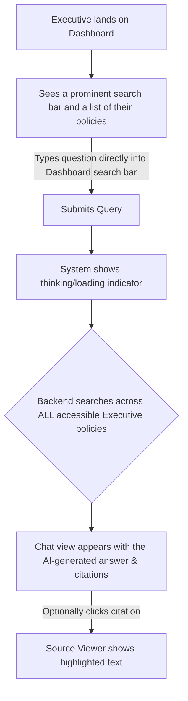

# PolicyAi UI/UX Specification

### Introduction

This document defines the user experience goals, information architecture, user flows, and visual design specifications for PolicyAi's user interface. It serves as the foundation for visual design and frontend development, ensuring a cohesive and user-centered experience.

#### Overall UX Goals & Principles (Refined)

##### Target User Personas
* **Primary: Administrators (HR, Legal, Compliance Officers):** Detail-oriented users responsible for creating, managing, and ensuring the accuracy of the policy library.
* **Secondary: Executives (C-Level, VPs):** Time-poor consumers of information who require immediate, trustworthy, and high-level answers to support strategic decisions.

##### Usability Goals
* **Efficiency:** An Administrator can successfully upload and categorize a new policy in under five minutes.
* **Speed:** An Executive can get a clear, cited answer to a specific policy question in under 30 seconds.
* **Trust:** All users must feel highly confident in the accuracy of the AI's answers and the security of the role-based data segregation.

##### Core Design Principles
1.  **Clarity Above All:** The interface must be unambiguous. The user must always know what data they are viewing (e.g., Administrator vs. Executive policies) and trust its source.
2.  **Minimalist & Focused:** The existing UI is clean, spacious, and minimalist. We will embrace this aesthetic to reduce cognitive load.
3.  **Authoritative & Trustworthy:** While the aesthetic is minimalist, the design elements must convey security and authority. We will use a corporate color palette and clear visual cues to build user trust.
4.  **Convention over Configuration:** We will use familiar, standard UI patterns to ensure the tool is immediately intuitive for all users.

---
### Information Architecture (IA)

#### Site Map / Screen Inventory
```mermaid
graph TD
    A[Sign In Page] --> B{User Authentication};
    B --> C[Dashboard];
    C --> D[Policy Document View];
    C --> C_NEW[Create New Policy Document];
    C --> E[Account Settings];
    E --> F[User Management (Super-Admin only)];
````

#### Navigation Structure

  * **Primary Navigation:** Navigation is primarily driven by selecting a "Policy Document" from the Dashboard. A persistent link back to the Dashboard (e.g., via the logo) is required.
  * **Secondary Navigation:** Within the "Policy Document View," a three-column layout (Desktop) or a tabbed interface (Mobile) will be used for Sources, Chat, and Saved Policies.
  * **Breadcrumb Strategy:** A simple breadcrumb (e.g., `Dashboard > [Policy Document Name]`) will provide context in the Policy Document View.

-----

### User Flows

#### Administrator - Add a New Policy Document

  * **User Goal:** To securely upload a new policy document and assign it to the correct user role.
  * **Entry Points:** From the main Dashboard, by clicking the "Create new" button.
  * **Success Criteria:** The administrator sees a confirmation of upload and processing, and the new "Policy Document" appears in their dashboard.

##### Flow Diagram

```mermaid
graph TD
    A[Dashboard] -->|Clicks 'Create new'| B(System creates new Policy Document);
    B --> C{Navigate to new Policy Document View};
    C --> D[User sees empty Chat Area with 'Upload a source' prompt];
    D -->|User clicks 'Upload a source'| E[Add Sources modal appears];
    E -->|User selects file| F(System prompts user to assign a role);
    F -->|User selects 'Admin' or 'Executive' & confirms| G(File upload & processing begins);
    G --> H[Success toast notification is shown];
    H --> I[New source appears in 'Sources' list with 'processing' status];
```

#### Executive - Ask a Policy Question (Refined)

  * **User Goal:** To ask a question from their main dashboard and receive a quick, trustworthy answer sourced from the entirety of their accessible Executive-level policies.
  * **Entry Points:** From the main Dashboard, using the primary conversational search bar.
  * **Success Criteria:** The Executive gets a concise, AI-generated answer with clear citations in under 30 seconds, without having to first navigate to a specific document.

##### Refined Flow Diagram



-----

### Wireframes & Mockups

**Primary Design Files:** [Link to Figma/Sketch/etc. to be added once high-fidelity designs are created]

#### Key Screen Layouts

  * **Sign-In Page:** Centered layout with logo, tagline, email/password inputs, and "Sign In" button.
  * **Dashboard:** Header with logo/profile. A prominent, primary conversational search bar above a grid of "Policy Document" cards. A "Create new" button for Administrators.
  * **Policy Document View:** A three-column layout (Desktop) or tabbed interface (Mobile) for "Sources," "Chat," and "Saved Policies".

-----

### Component Library / Design System

**Design System Approach:** We will use the existing **shadcn/ui** library as a foundation, customizing components to match the "PolicyAi" brand identity.

#### Core Components

  * **Policy Document Card:** Displays a policy summary on the dashboard. States: Default, Hover, Outdated.
  * **Role-Aware Search Bar:** The primary input for user queries. States: Default, Focused, Loading, Disabled.
  * **Source List Item:** Displays an individual source file in the sidebar. States: Default, Selected, Processing, Error.
  * **Citation Button:** A clickable element in AI responses to link to a source.

-----

### Branding & Style Guide (Refined)

#### Color Palette

| Color Type | Hex Code | Usage |
| :--- | :--- | :--- |
| Primary | `#2563EB` (Blue) | Key interactive elements, secondary buttons, links. |
| Secondary | `#475569` (Slate) | Secondary text, less important UI elements. |
| Accent | `#16A34A` (Green) | Primary buttons, confirmation actions, success states. |
| Warning | `#F59E0B` (Amber) | Non-critical alerts, warnings (e.g., outdated policy). |
| Error | `#DC2626` (Red) | Error messages, destructive action confirmation. |
| Neutral | `#F8FAFC` to `#0F172A`| Backgrounds, borders, and body text. |

#### Typography & Iconography

  * **Font:** Inter (for both headings and body).
  * **Icon Library:** Lucide React.

#### UI States & Dark Mode

  * **States:** All interactive elements must have clear focus, disabled, and hover/active states.
  * **Dark Mode:** A dark mode theme is required and must maintain WCAG AA contrast ratios.

-----

### Accessibility & Responsiveness

  * **Accessibility Standard:** WCAG 2.1 Level AA.
  * **Responsiveness Strategy:** The three-column desktop layout will collapse into a tabbed interface on screens narrower than 1024px, as demonstrated by the existing `MobileNotebookTabs.tsx` component.

-----

### Next Steps

#### Immediate Actions

1.  Final approval of this UI/UX Specification.
2.  Handoff to the **Architect** to create the detailed `fullstack-architecture.md`.

#### Design Handoff Checklist

  * [x] All user flows documented
  * [x] Component inventory complete
  * [x] Accessibility requirements defined
  * [x] Responsive strategy clear
  * [x] Brand guidelines incorporated
  * [x] Performance goals established

<!-- end list -->

