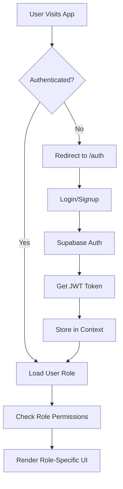

# Frontend Architecture

This document provides a comprehensive overview of the PolicyAi frontend architecture, including component structure, data flow, authentication, role-based access control, and key user interfaces.

## Overview

The PolicyAi frontend is a React-based Single Page Application (SPA) built with TypeScript, using modern React patterns including hooks, context, and TanStack Query for state management. The application has been transformed from a traditional policy document management system to a **chat-first interface** focused on conversational interaction with policy documents. The application implements role-based access control (RBAC) with three user roles: `administrator`, `executive`, and `board`.

## Architecture Transformation (January 2025)

PolicyAi has undergone a significant UI/UX transformation from a document-centric to a chat-centric interface:

### Previous Architecture (Document-Focused)

- Document upload and management as primary interface
- Policy document cards with upload buttons
- Traditional file management workflows
- Complex role assignment interfaces

### Current Architecture (Chat-Focused)

- **Chat-first user experience**: All interactions prioritize conversational AI
- **Simplified dashboard**: Landing page guides users to create new chats
- **Streamlined navigation**: Removed complex document management UI
- **Integrated title editing**: In-line editing of chat titles and descriptions
- **Clean role management**: Simplified role-based access without complex UI elements

### Key Component Transformations

#### EmptyDashboard Component
- **Before**: Featured "Upload Policy Document" button and document management focus
- **After**: Transformed to "Create New Chat" with MessageCircle icon and chat-focused onboarding
- **Impact**: Guides users directly to conversational interface instead of document upload

#### NotebookCard Component
- **Before**: Complex role assignment dropdowns and management interfaces
- **After**: Clean card design with integrated title editing functionality
- **Impact**: Simplified user experience with focus on content rather than administrative tasks

#### NotebookGrid Component
- **Before**: Included "Upload Policy" buttons and document-centric actions
- **After**: Streamlined grid focused purely on chat/notebook display and creation
- **Impact**: Removed document upload complexity from main interface

#### NotebookTitleEditor Component (New)
- **Purpose**: Dedicated dialog-based editor for chat titles and descriptions
- **Features**: Real-time editing with Supabase integration and user feedback
- **Impact**: Enables seamless content management without navigating away from main interface

## Tech Stack

| Component | Technology | Version | Purpose |
|-----------|------------|---------|---------|
| Framework | React | 18.3.1 | UI Framework |
| Language | TypeScript | 5.5.3 | Type Safety |
| UI Library | shadcn/ui | Latest | Component Library |
| State Management | TanStack Query | 5.56.2 | Server State |
| Styling | Tailwind CSS | 3.4.11 | Utility-first CSS |
| Build Tool | Vite | 5.4.1 | Development & Build |
| Testing | Vitest + RTL | Latest | Unit Testing |

## Authentication & Authorization

### Authentication Flow



### User Roles & Permissions

| Role | Permissions | UI Access |
|------|-------------|-----------|
| **Board** | Full system access, user management | All features, admin panel |
| **Administrator** | Policy management, document upload, user assignment | Policy management, document upload, role assignment |
| **Executive** | Document access, chat with policies | Document viewing, chat interface |

### Role-Based UI Components

```typescript
// Role-based component rendering
const { userRole, hasRole, isAdministrator, isExecutive, isSuperAdmin } = useUserRole();

// Example usage
{hasRole('administrator') && <AdminPanel />}
{isExecutive() && <ExecutiveDashboard />}
{isSuperAdmin() && <UserManagement />}
```

### Recent Enhancements (September 2025)

#### Role-Based Document Visibility
- **Implementation**: Enhanced `SourcesSidebar` component with role-based filtering
- **Components Updated**: 
  - `SourcesSidebar.tsx`: Added role badges and policy date display
  - `RoleAssignmentBadge.tsx`: Extended to support 'board' role
  - `UserGreetingCard.tsx`: Fixed role display for 'board' users
- **Data Filtering**: Role-based source filtering in `useSources.tsx` hook

#### UI Enhancements
- **Role Badges**: Visual indicators showing document role assignments
  - Administrator: Blue badge with Shield icon
  - Executive: Purple badge with Shield icon  
  - Board: Green badge with Shield icon
- **Policy Dates**: Display policy effective dates with age-based visual indicators:
  - Green badges: Current policies (≤18 months old)
  - Red badges: Outdated policies (>18 months old)  
  - Yellow badges: Missing date information ("Not Provided")
- **Enhanced Cards**: Source cards now show role and date metadata

## Component Architecture

### Core Components Structure

```text
src/
├── components/
│   ├── auth/                 # Authentication components
│   │   ├── LoginForm.tsx
│   │   ├── SignupForm.tsx
│   │   └── AuthGuard.tsx
│   ├── dashboard/           # Chat-focused dashboard components
│   │   ├── EmptyDashboard.tsx      # Chat onboarding (transformed)
│   │   ├── NotebookCard.tsx        # Clean chat cards (simplified)
│   │   ├── NotebookGrid.tsx        # Chat grid display (streamlined)
│   │   └── NotebookTitleEditor.tsx # Title/description editor (new)
│   ├── chat/                # Core chat interface
│   │   ├── ChatInterface.tsx
│   │   ├── MessageList.tsx
│   │   ├── MessageInput.tsx
│   │   └── SourcesSidebar.tsx
│   ├── notebook/            # Chat notebook management
│   │   ├── NotebookList.tsx
│   │   ├── NotebookViewer.tsx
│   │   ├── SourcesSidebar.tsx    # Enhanced with fallback citation logic
│   │   └── SourceItem.tsx
│   ├── admin/               # Admin-only components (background)
│   │   ├── UserManagement.tsx
│   │   └── SystemSettings.tsx
│   └── ui/                  # Reusable UI components
│       ├── Button.tsx
│       ├── Input.tsx
│       ├── Card.tsx
│       ├── Dialog.tsx
│       └── UserGreetingCard.tsx
```

### Component Transformation Details

#### Transformed Components

##### EmptyDashboard.tsx

- **Purpose**: Landing page for chat creation and onboarding
- **Key Changes**: Removed upload functionality, added chat-focused messaging
- **Current Features**:
  - "Create New Chat" button with MessageCircle icon
  - Chat-focused welcome messaging
  - Direct integration with chat creation flow

##### NotebookCard.tsx

- **Purpose**: Display individual chat/notebook cards
- **Key Changes**: Removed role assignment UI, integrated title editing
- **Current Features**:
  - Clean card design without complex controls
  - Integrated NotebookTitleEditor for seamless editing
  - Simplified interaction patterns

##### NotebookGrid.tsx

- **Purpose**: Main dashboard grid for chat display
- **Key Changes**: Removed "Upload Policy" buttons, cleaned unused imports, implemented bulk delete functionality
- **Current Features**:
  - Pure grid display of chat notebooks
  - Streamlined creation flow
  - Focus on content over administration
  - **Bulk Delete Operations**: Multi-select with confirmation dialogs (September 2025)
  - **Safety Features**: Count-based selection feedback and deletion confirmation

#### New Components

##### NotebookTitleEditor.tsx

- **Purpose**: Dialog-based editor for chat titles and descriptions
- **Features**:
  - Modal dialog with form controls
  - Real-time Supabase integration
  - User feedback with toast notifications
  - Validation and error handling

#### Removed/Simplified Components

- **Document Upload UI**: Upload buttons and complex file management removed from main interface
- **Role Assignment Dropdowns**: Complex role management UI simplified or moved to background
- **Policy Management Cards**: Document-centric cards replaced with chat-focused design

### Key Data Models

#### User Profile
```typescript
interface Profile {
  id: string;
  email: string;
  full_name: string | null;
  avatar_url: string | null;
  created_at: string;
  updated_at: string;
}
```

#### User Role
```typescript
interface UserRole {
  id: string;
  user_id: string;
  role: 'administrator' | 'executive' | 'board';
  created_at: string;
  updated_at: string;
}
```

#### Policy Document
```typescript
interface PolicyDocument {
  id: string;
  user_id: string;
  title: string;
  description: string | null;
  color: string;
  icon: string;
  generation_status: string;
  example_questions: string[];
  created_at: string;
  updated_at: string;
  role_assignment: 'administrator' | 'executive' | 'board' | null;
}
```

#### Source Document
```typescript
interface Source {
  id: string;
  notebook_id: string;
  title: string;
  type: string;
  url: string | null;
  file_path: string | null;
  file_size: number | null;
  display_name: string | null;
  content: string | null;
  summary: string | null;
  processing_status: string;
  metadata: Record<string, any>;
  created_at: string;
  updated_at: string;
  visibility_scope: 'notebook' | 'role' | 'global';
  target_role: 'administrator' | 'executive' | 'board' | null;
  uploaded_by_user_id: string | null;
  policyType: string | null;
  policyDate: string | null;
  policyName: string | null;
}
```

#### Document (Vector Store)
```typescript
interface Document {
  id: number;
  content: string | null;
  metadata: Record<string, any>;
  embedding: number[] | null;
  policyType: string | null;
  policyDate: string | null;
  policyName: string | null;
  source_id: string | null;
}
```

## State Management

### Context Providers

#### AuthContext
```typescript
interface AuthContextType {
  user: User | null;
  isAuthenticated: boolean;
  isLoading: boolean;
  signIn: (email: string, password: string) => Promise<void>;
  signUp: (email: string, password: string) => Promise<void>;
  signOut: () => Promise<void>;
}
```

#### User Role Context
```typescript
interface UserRoleContextType {
  userRole: UserRole | null;
  isLoading: boolean;
  error: Error | null;
  hasRole: (role: UserRole) => boolean;
  isAdministrator: () => boolean;
  isExecutive: () => boolean;
  isSuperAdmin: () => boolean;
  refetch: () => void;
}
```

### TanStack Query Integration

#### Key Queries
```typescript
// User role query
const { data: userRole, isLoading, error } = useQuery({
  queryKey: ['user-role', user?.id],
  queryFn: getCurrentUserRole,
  enabled: !!user?.id && isAuthenticated,
  staleTime: 5 * 60 * 1000, // 5 minutes
  gcTime: 10 * 60 * 1000, // 10 minutes
});

// Policy documents query
const { data: documents } = useQuery({
  queryKey: ['policy-documents', userRole],
  queryFn: () => getPolicyDocuments(userRole),
  enabled: !!userRole,
});

// Sources query
const { data: sources } = useQuery({
  queryKey: ['sources', notebookId],
  queryFn: () => getSources(notebookId),
  enabled: !!notebookId,
});
```

## Key User Interfaces

### 1. Authentication Pages

#### Login Page (`/auth`)
- **Components**: `LoginForm`, `SignupForm`
- **Features**: Email/password authentication, form validation
- **Access**: Public (unauthenticated users)

#### Fields:
- Email (required, email validation)
- Password (required, min 6 characters)
- Remember me checkbox
- Forgot password link

### 2. Dashboard Pages

#### Administrator Dashboard (`/dashboard`)
- **Components**: `AdminDashboard`, `DocumentUpload`, `UserManagement`
- **Features**: 
  - Document upload and management
  - User role assignment
  - Policy document creation
  - System settings access
- **Access**: `administrator` and `board` roles only

#### Executive Dashboard (`/dashboard`)
- **Components**: `ExecutiveDashboard`, `DocumentList`, `ChatInterface`
- **Features**:
  - View assigned policy documents
  - Chat with policy documents
  - Access to role-specific content
- **Access**: `executive` role and above

### 3. Document Management

#### Document Upload (`/documents/upload`)
- **Components**: `DocumentUpload`, `FileDropzone`, `MetadataForm`
- **Features**:
  - Drag & drop file upload
  - Metadata extraction
  - Role assignment for documents
  - Processing status tracking
- **Access**: `administrator` and `board` roles only

#### Document List (`/documents`)
- **Components**: `DocumentList`, `DocumentCard`, `FilterControls`
- **Features**:
  - Filter by role assignment
  - Search documents
  - View processing status
  - Access document details
- **Access**: Role-based (users see documents assigned to their role)

### 4. Chat Interface

#### Chat Page (`/chat/:notebookId`)
- **Components**: `ChatInterface`, `MessageList`, `MessageInput`, `SourcesSidebar`
- **Features**:
  - Real-time chat with policy documents
  - Source citation display
  - Message history
  - Role-based document access
- **Access**: All authenticated users (content filtered by role)

#### Chat Fields:
- Message input (text area)
- Send button
- Message history (scrollable)
- Source citations (expandable)
- Typing indicators

### 5. Notebook Management

#### Notebook List (`/notebooks`)
- **Components**: `NotebookList`, `NotebookCard`, `CreateNotebook`
- **Features**:
  - Create new policy notebooks
  - View existing notebooks
  - Role-based access control
  - Notebook metadata display
- **Access**: All authenticated users

#### Notebook Viewer (`/notebooks/:id`)
- **Components**: `NotebookViewer`, `SourcesSidebar`, `ChatInterface`
- **Features**:
  - View notebook details
  - Access to sources
  - Chat with notebook content
  - Source management
- **Access**: Role-based (users see notebooks assigned to their role)

### 6. Admin Panel

#### User Management (`/admin/users`)
- **Components**: `UserManagement`, `UserList`, `RoleAssignment`
- **Features**:
  - View all users
  - Assign/revoke roles
  - User activity tracking
  - Bulk operations
- **Access**: `board` role only

#### System Settings (`/admin/settings`)
- **Components**: `SystemSettings`, `ConfigurationPanel`
- **Features**:
  - System configuration
  - Role management
  - Security settings
  - Audit logs
- **Access**: `board` role only

## Data Flow Patterns

### 1. Authentication Flow
```typescript
// 1. User attempts to access protected route
// 2. AuthGuard checks authentication status
// 3. If not authenticated, redirect to /auth
// 4. If authenticated, load user role
// 5. Check role permissions for the route
// 6. Render appropriate UI based on role
```

### 2. Document Upload Flow
```typescript
// 1. User selects files in DocumentUpload component
// 2. Files are validated (type, size, etc.)
// 3. Metadata is extracted from files
// 4. Files are uploaded to Supabase Storage
// 5. Document records are created in database
// 6. N8N workflow is triggered for processing
// 7. User is redirected to document list
```

### 3. Chat Flow
```typescript
// 1. User types message in ChatInterface
// 2. Message is sent to Supabase Edge Function
// 3. Edge Function calls N8N chat workflow
// 4. N8N processes query with RAG pipeline
// 5. Response is returned with sources
// 6. UI updates with response and citations
```

## Security Implementation

### Row Level Security (RLS)
- All database queries are protected by RLS policies
- Policies are role-based and user-specific
- Service role bypasses RLS for system operations

### Frontend Security
- Route protection based on user roles
- Component-level access control
- Secure token storage in context
- Input validation and sanitization

### API Security
- JWT token validation on all requests
- Role-based endpoint access
- Rate limiting on sensitive operations
- Input validation on all API calls

## Performance Optimizations

### Caching Strategy
- TanStack Query for server state caching
- React Query DevTools for debugging
- Optimistic updates for better UX
- Background refetching for fresh data

### Code Splitting
- Route-based code splitting
- Lazy loading of admin components
- Dynamic imports for heavy components
- Bundle analysis and optimization

### UI Performance
- Virtual scrolling for large lists
- Debounced search inputs
- Optimized re-renders with React.memo
- Efficient state updates

## Development Guidelines

### Component Development
1. Use TypeScript for all components
2. Follow the established component structure
3. Implement proper error boundaries
4. Use consistent naming conventions
5. Write unit tests for complex logic

### State Management
1. Use TanStack Query for server state
2. Use React Context for global client state
3. Keep component state local when possible
4. Implement proper loading and error states

### Security Best Practices
1. Always validate user input
2. Implement proper role checks
3. Use secure authentication patterns
4. Follow OWASP guidelines for frontend security

## Testing Strategy

### Unit Tests
- Component testing with React Testing Library
- Hook testing for custom hooks
- Utility function testing
- Mock external dependencies

### Integration Tests
- API integration testing
- Authentication flow testing
- Role-based access testing
- End-to-end user journeys

### E2E Tests
- Critical user paths
- Cross-browser compatibility
- Performance testing
- Accessibility testing

## Deployment & Build

### Build Process
```bash
# Development
npm run dev

# Production build
npm run build

# Preview build
npm run preview

# Type checking
npm run type-check

# Linting
npm run lint

# Testing
npm run test
```

### Environment Configuration
- Development: Local Supabase instance
- Staging: Supabase staging project
- Production: Supabase production project

### Deployment
- Frontend: Vercel/Netlify
- Database: Supabase Cloud
- Workflows: N8N Cloud
- Monitoring: Built-in Supabase analytics

## Troubleshooting

### Common Issues
1. **Authentication errors**: Check JWT token validity
2. **Role access issues**: Verify RLS policies
3. **API errors**: Check network connectivity and API keys
4. **Performance issues**: Monitor bundle size and query efficiency

### Debug Tools
- React Query DevTools
- Supabase Dashboard
- Browser DevTools
- Network tab for API debugging

## Future Enhancements

### Recently Completed Features (2025)
- **Policy Age Indicators** (September 2025): Color-coded visual indicators for policy document age (current/outdated/missing dates)
- **Bulk Delete Operations** (September 2025): Multi-select chat deletion with confirmation dialogs and safety features
- **UI/UX Terminology Consistency** (September 2025): Updated default titles, global sources display, and role-appropriate information across components
- **Enhanced Citation Handling** (January 2025): Improved fallback logic for citation display when source content is not available, providing meaningful user feedback instead of "Unknown Source" messages

### Planned Features
- Real-time notifications  
- Advanced search capabilities
- Document versioning
- Collaborative features
- Mobile app support
- Chat response disclaimers for outdated policies

### Technical Improvements
- Micro-frontend architecture
- Advanced caching strategies
- Progressive Web App (PWA) features
- Enhanced accessibility
- Performance monitoring

---

This document serves as the definitive guide for frontend development on the PolicyAi project. It should be updated as the application evolves and new features are added.
