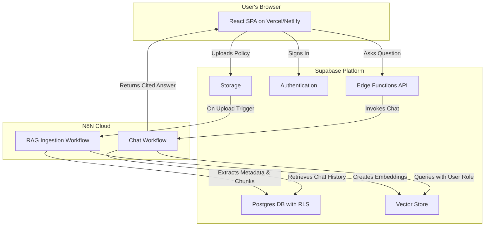

# High Level Architecture

* **Technical Summary:** The architecture for PolicyAi is a serverless, full-stack application leveraging Supabase and N8N. The frontend is a React SPA communicating via Supabase Edge Functions with backend N8N workflows that handle the specialized RAG pipeline. This reuses the "InsightsLM" foundation while extending it with a robust, role-based security model enforced by Postgres Row Level Security.
* **Platform:** Supabase (backend) & Vercel/Netlify (frontend).
* **Repository Structure:** Monorepo, to simplify dependency management and ensure consistency.

## High Level Architecture Diagram

