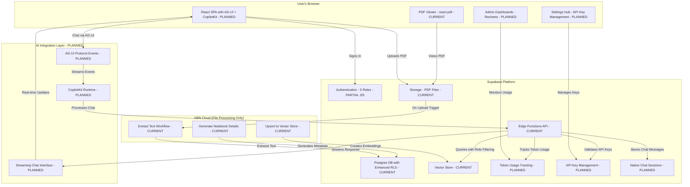
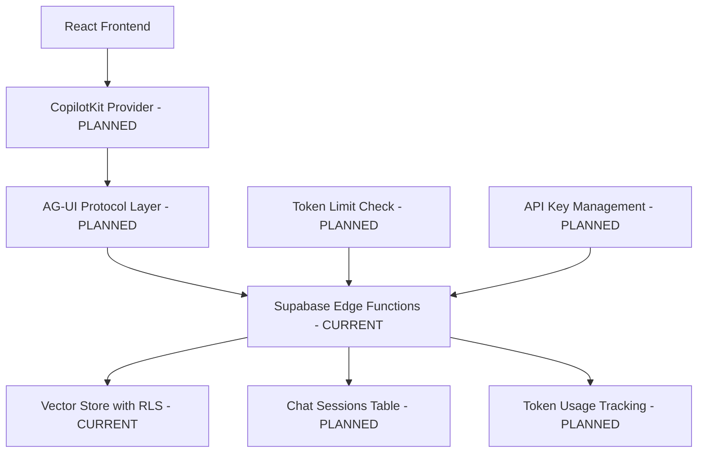

# High Level Architecture (Future Vision)

**⚠️ PLANNED ARCHITECTURE** - See [Current Architecture](../../current/current-architecture.md) for as-implemented system

---

* **Technical Summary (Target State):** PolicyAi is a comprehensive SaaS application with advanced AI capabilities, built on a serverless architecture leveraging Supabase and integrated AI frameworks. The system features a 5-role hierarchy with in-app AI chat powered by AG-UI Protocol and CopilotKit, comprehensive token usage tracking, API key management, and enhanced document viewing with PDF support. The architecture maintains n8n for file processing while migrating chat functionality to native in-app implementation.

* **Current Reality**: PolicyAi uses Supabase backend with N8N webhooks for all AI interactions, 3-role RBAC, basic PDF viewing. See [docs/current/current-architecture.md](../../current/current-architecture.md) for current implementation.

* **Platform:** Supabase (backend) & Vercel/Netlify (frontend).
* **Repository Structure:** Monorepo, to simplify dependency management and ensure consistency.
* **AI Integration (Planned):** AG-UI Protocol + CopilotKit for real-time streaming chat with role-based document access.
* **AI Integration (Current):** N8N Cloud workflows via webhooks for document processing and chat.

## High Level Architecture Diagram (Planned - Future Vision)

**Status**: 📋 **PLANNED** - Shows target architecture after Epic 2 completion

```mermaid
graph TD
    subgraph "User's Browser"
        A[React SPA with AG-UI + CopilotKit - PLANNED]
        A1[PDF Viewer - react-pdf - CURRENT]
        A2[Admin Dashboards - Recharts - PLANNED]
        A3[Settings Hub - API Key Management - PLANNED]
    end

    subgraph "Supabase Platform"
        B[Edge Functions API - CURRENT]
        C[Authentication - 5 Roles - PARTIAL 3/5]
        D[Storage - PDF Files - CURRENT]
        E[Postgres DB with Enhanced RLS - CURRENT]
        F[Vector Store - CURRENT]
        G[Token Usage Tracking - PLANNED]
        H[API Key Management - PLANNED]
        I[Native Chat Sessions - PLANNED]
    end

    subgraph "N8N Cloud (File Processing Only)"
        J[Extract Text Workflow - CURRENT]
        K[Upsert to Vector Store - CURRENT]
        L[Generate Notebook Details - CURRENT]
    end

    subgraph "AI Integration Layer - PLANNED"
        M[AG-UI Protocol Events - PLANNED]
        N[CopilotKit Runtime - PLANNED]
        O[Streaming Chat Interface - PLANNED]
    end

    A -- "Signs In" --> C
    A -- "Uploads PDF" --> D
    A -- "Chat via AG-UI" --> M
    A1 -- "Views PDF" --> D
    A2 -- "Monitors Usage" --> G
    A3 -- "Manages Keys" --> H

    D -- "On Upload Trigger" --> J
    M -- "Streams Events" --> N
    N -- "Processes Chat" --> B

    J -- "Extracts Text" --> E
    K -- "Creates Embeddings" --> F
    L -- "Generates Metadata" --> E

    B -- "Queries with Role Filtering" --> F
    B -- "Tracks Token Usage" --> G
    B -- "Validates API Keys" --> H
    B -- "Stores Chat Messages" --> I
    B -- "Streams Response" --> O
    O -- "Real-time Updates" --> A
```

**Legend**:
- **CURRENT**: Implemented and working
- **PARTIAL X/Y**: X out of Y features implemented
- **PLANNED**: Not yet implemented

## AI Integration Architecture

### AG-UI + CopilotKit Stack (Epic 2 - PLANNED)

**Status**: 📋 **NOT IMPLEMENTED** - See roadmap Epic 2 for timeline

```mermaid
graph TD
    A[React Frontend] --> B[CopilotKit Provider - PLANNED]
    B --> C[AG-UI Protocol Layer - PLANNED]
    C --> D[Supabase Edge Functions - CURRENT]
    D --> E[Vector Store with RLS - CURRENT]
    D --> F[Chat Sessions Table - PLANNED]
    D --> G[Token Usage Tracking - PLANNED]

    H[Token Limit Check - PLANNED] --> D
    I[API Key Management - PLANNED] --> D
```

### Chat Flow (Planned Native Implementation)

**Current**: N8N webhook-based chat (see [Current Architecture](../../current/current-architecture.md))

**Target** (after Epic 2 implementation):

1. User sends message via CopilotKit UI
2. AG-UI protocol packages message with role context
3. Supabase Edge Function receives request
4. Check user limits (token_usage + user_limits)
5. Query vector store with RLS-filtered access
6. Stream response back through AG-UI
7. Track tokens and update limits
8. Store in chat_sessions/chat_messages

### File Processing (Current - Remains in N8N)

**Status**: ✅ **WORKING** - N8N workflows

- Extract Text workflow (Mistral OCR)
- Upsert to Vector Store workflow
- Generate Policy Document Details workflow

**Note**: File processing will remain in N8N even after Epic 2 chat migration.
