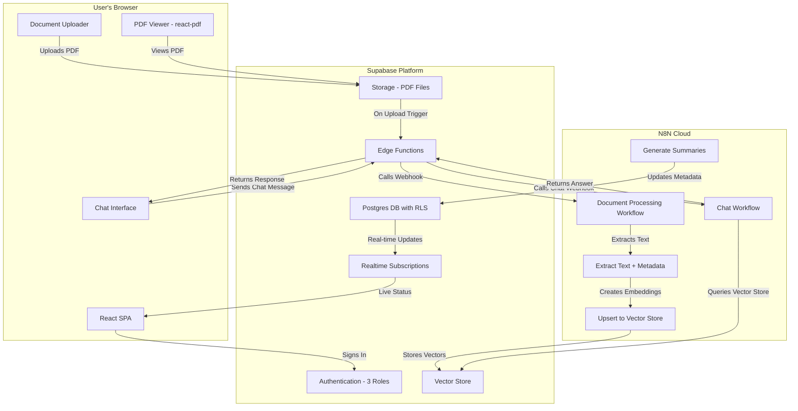

# PolicyAi Current Architecture (As-Implemented)

**Last Updated**: 2025-10-20
**Version**: v1.0-beta
**Status**: CURRENT IMPLEMENTATION

---

## ⚠️ Important Note

This document describes the **actual implemented architecture**, not the aspirational future state. For planned architecture features (AG-UI/CopilotKit, 5-role hierarchy, token tracking), see [docs/architecture/](../architecture/) (marked as future vision).

---

## High-Level Architecture Overview

PolicyAi is a serverless web application built on Supabase and N8N for AI-powered policy document management with role-based access control.

**Platform**:
- **Frontend**: Vercel (or any static hosting)
- **Backend**: Supabase (Auth, Database, Storage, Edge Functions, Realtime)
- **Workflows**: N8N Cloud (document processing, AI chat)

**Repository Structure**: Monorepo with React frontend and Supabase backend

---

## Current Architecture Diagram



---

## Tech Stack (Current Implementation)

### Frontend
| Technology | Version | Purpose |
|------------|---------|---------|
| **React** | 18.3.1 | UI Framework |
| **TypeScript** | 5.5.3 | Type Safety |
| **Vite** | 5.4.1 | Build Tool |
| **Tailwind CSS** | 3.4.11 | Styling |
| **shadcn/ui** | Latest | Component Library |
| **TanStack Query** | 5.56.2 | Server State Management |
| **react-pdf** | 7.7.0 | PDF Viewer |
| **Sonner** | Latest | Toast Notifications |

### Backend
| Technology | Version | Purpose |
|------------|---------|---------|
| **Supabase Auth** | Cloud | User Authentication |
| **PostgreSQL** | 15 (Supabase) | Database |
| **Supabase Storage** | Cloud | File Storage (PDFs) |
| **Supabase Edge Functions** | Deno | Serverless API |
| **Supabase Realtime** | Cloud | Live Updates |
| **N8N** | Cloud | Workflows & AI |

### AI Integration
| Technology | Purpose |
|------------|---------|
| **N8N Workflows** | Document processing, chat, embeddings |
| **OpenAI / Gemini** | LLM provider (via N8N) |
| **Supabase Vector Store** | pgvector for embeddings |

---

## Role-Based Access Control (3 Roles)

### Current Roles
1. **Board Member**
   - Access: All documents
   - Permissions: Read-only, chat
   - Use Case: Strategic oversight

2. **Administrator**
   - Access: Administrator-tier documents
   - Permissions: Upload, manage, chat
   - Use Case: Policy management (HR/Legal/Compliance)

3. **Executive**
   - Access: Executive-tier documents
   - Permissions: Read-only, chat
   - Use Case: Policy consumption (C-Level/VPs)

### Authorization Enforcement
- **Database Level**: PostgreSQL Row Level Security (RLS) policies
- **Application Level**: React context + Supabase client
- **Workflow Level**: N8N workflows filter by user role

**Authorization Matrix**:
| Action | Board | Administrator | Executive |
|--------|-------|---------------|-----------|
| Upload Documents | ❌ | ✅ | ❌ |
| View Own Role Docs | ✅ (All) | ✅ | ✅ |
| Assign Role to Doc | ❌ | ✅ | ❌ |
| Chat with AI | ✅ | ✅ | ✅ |
| View PDF | ✅ | ✅ | ✅ |

---

## Document Upload & Processing Pipeline

### Flow
1. **User uploads PDF** via React UI
2. **File stored** in Supabase Storage (`sources` bucket)
3. **Database record** created in `sources` table (status: `processing`)
4. **Edge Function** triggered on insert
5. **N8N webhook** called with document metadata
6. **N8N extracts text** using Mistral OCR or similar
7. **Text chunked** and embedded (OpenAI/Gemini)
8. **Vectors upserted** to Supabase pgvector store
9. **Metadata updated** (status: `completed`, summary generated)
10. **Realtime notification** sent to frontend
11. **UI updates** to show completed status

### Database Schema (Simplified)
```sql
-- Sources table (documents)
CREATE TABLE sources (
  id UUID PRIMARY KEY,
  user_id UUID REFERENCES auth.users,
  file_url TEXT,
  status TEXT, -- 'processing' | 'completed' | 'error'
  target_role TEXT, -- 'board' | 'administrator' | 'executive'
  policy_date TEXT,
  policy_name TEXT,
  policy_type TEXT,
  summary TEXT,
  created_at TIMESTAMPTZ,
  updated_at TIMESTAMPTZ
);

-- RLS Policy Example
CREATE POLICY "Users see their role documents"
ON sources FOR SELECT
USING (
  target_role = (SELECT role FROM user_roles WHERE user_id = auth.uid())
);
```

---

## AI Chat Architecture

### Current Implementation (N8N Webhooks)

**Flow**:
1. User types question in chat interface
2. Frontend sends message to Supabase Edge Function (`/api/chat`)
3. Edge Function forwards to N8N chat webhook
4. N8N workflow:
   - Receives user query + user_id
   - Looks up user role from database
   - Queries vector store with role filter
   - Generates answer using LLM (OpenAI/Gemini)
   - Returns answer with citations
5. Edge Function returns response to frontend
6. Frontend displays answer with source links

**Technologies**:
- N8N Cloud for orchestration
- OpenAI/Gemini for LLM
- Supabase pgvector for semantic search
- Supabase RLS for role filtering

**Not Using** (Planned Future):
- ❌ AG-UI Protocol
- ❌ CopilotKit
- ❌ In-app streaming
- ❌ Native chat session management

---

## PDF Viewing

**Current Implementation**:
- `react-pdf` library (v7.7.0)
- Basic page navigation
- Zoom controls (fit to width, fit to page, zoom %)
- Text selection for copying
- Print functionality

**Not Implemented** (Planned Future):
- ❌ Page thumbnails sidebar
- ❌ In-document text search
- ❌ Citation highlighting
- ❌ Keyboard shortcuts

---

## Real-Time Updates

**Technology**: Supabase Realtime (WebSocket subscriptions)

**Use Cases**:
1. **Document Processing Status**
   - Subscribe to `sources` table
   - Listen for status changes (`processing` → `completed`)
   - Update UI in real-time without polling

2. **Future**: Chat message updates (not currently used)

**Implementation**:
```typescript
// Example: Subscribe to document status changes
const { data, error } = await supabase
  .from('sources')
  .select('*')
  .eq('user_id', userId)
  .subscribe((payload) => {
    // Handle real-time update
    updateDocumentStatus(payload.new);
  });
```

---

## Security

### Authentication
- **Supabase Auth**: Email/password
- **JWT Tokens**: Stateless authentication
- **Session Management**: Automatic token refresh

### Authorization
- **Row Level Security (RLS)**: Database-level enforcement
- **Role-Based Policies**: Separate policies per role
- **No Server-Side Bypass**: All queries go through RLS

### Data Protection
- **Encrypted at Rest**: Supabase default encryption
- **HTTPS Only**: All connections encrypted in transit
- **Private Storage Buckets**: No public file access (RLS-protected)

### API Key Security
- **Environment Variables**: Stored in Supabase secrets
- **No Client Exposure**: Never sent to frontend
- **N8N Credentials**: Managed in N8N Cloud

---

## Edge Functions

**Current Functions**:
1. **process-document** - Triggers N8N workflow after upload
2. **process-document-callback** - Updates database after N8N processing
3. **get-pdf-url** - Generates signed URLs for PDF access

**Not Implemented** (Planned Future):
- ❌ Native chat handler (still using N8N webhook)
- ❌ Token usage tracking
- ❌ API key management endpoints
- ❌ User limit enforcement

---

## Database Schema (Key Tables)

### Current Tables
```sql
-- User roles
CREATE TABLE user_roles (
  user_id UUID PRIMARY KEY REFERENCES auth.users,
  role TEXT NOT NULL CHECK (role IN ('board', 'administrator', 'executive')),
  created_at TIMESTAMPTZ DEFAULT NOW()
);

-- Documents (sources)
CREATE TABLE sources (
  id UUID PRIMARY KEY DEFAULT gen_random_uuid(),
  user_id UUID REFERENCES auth.users,
  file_url TEXT NOT NULL,
  status TEXT NOT NULL,
  target_role TEXT,
  policy_date TEXT,
  policy_name TEXT,
  policy_type TEXT,
  summary TEXT,
  created_at TIMESTAMPTZ DEFAULT NOW(),
  updated_at TIMESTAMPTZ DEFAULT NOW()
);

-- Vector embeddings
CREATE TABLE documents (
  id UUID PRIMARY KEY DEFAULT gen_random_uuid(),
  source_id UUID REFERENCES sources,
  content TEXT NOT NULL,
  embedding VECTOR(1536),
  metadata JSONB,
  created_at TIMESTAMPTZ DEFAULT NOW()
);

-- N8N chat history
CREATE TABLE n8n_chat_histories (
  id UUID PRIMARY KEY DEFAULT gen_random_uuid(),
  user_id UUID REFERENCES auth.users,
  notebook_id UUID REFERENCES sources,
  session_id TEXT,
  message JSONB,
  role TEXT,
  created_at TIMESTAMPTZ DEFAULT NOW()
);
```

### Not Implemented (Planned Future)
- ❌ `api_keys` table
- ❌ `token_usage` table
- ❌ `user_limits` table
- ❌ `chat_sessions` table (native)
- ❌ `chat_messages` table (native)

---

## N8N Workflows

### Current Workflows
1. **document-processing.json**
   - Triggered by: Supabase Edge Function
   - Input: Document metadata + file URL
   - Steps:
     - Download PDF from Supabase Storage
     - Extract text (Mistral OCR)
     - Extract metadata (policy date, name, type)
     - Generate summary
     - Chunk text
     - Generate embeddings
     - Upsert to vector store
   - Output: Callback to Edge Function with status

2. **chat.json**
   - Triggered by: Supabase Edge Function (chat request)
   - Input: User query + user_id
   - Steps:
     - Look up user role
     - Query vector store with role filter
     - Retrieve relevant chunks
     - Generate answer with LLM
     - Extract citations
   - Output: Answer + citations

3. **process-document-callback.json**
   - Triggered by: N8N document-processing workflow
   - Input: Processing status + metadata
   - Steps:
     - Update `sources` table status
     - Store summary and extracted metadata
   - Output: Database updated

---

## Deployment

### Frontend Deployment
- **Platform**: Vercel (or any static host)
- **Build**: `npm run build`
- **Environment Variables**:
  - `VITE_SUPABASE_URL`
  - `VITE_SUPABASE_ANON_KEY`

### Backend Deployment
- **Supabase**: Cloud-hosted (no deployment needed)
- **Edge Functions**: Deployed via Supabase CLI
  ```bash
  npx supabase functions deploy process-document
  npx supabase functions deploy process-document-callback
  npx supabase functions deploy get-pdf-url
  ```

### N8N Workflows
- **Platform**: N8N Cloud
- **Deployment**: Import workflow JSON, configure credentials
- **Webhooks**: Expose public webhook URLs for Supabase to call

---

## Performance Characteristics

### Current Performance
- **Document Upload**: 2-5 seconds (file transfer)
- **Processing Time**: 30-60 seconds (OCR + embedding)
- **Chat Response**: 5-10 seconds (vector search + LLM)
- **PDF Viewing**: 1-2 seconds (first page load)
- **Real-time Updates**: <1 second (WebSocket)

### Known Performance Issues
- **Slow Loading (10+ Documents)**: No pagination, loads all at once
  - **Impact**: 3-5 second load time with 10+ documents
  - **Mitigation**: Planned pagination

- **No Caching**: Every query hits database
  - **Impact**: Slower than optimal
  - **Mitigation**: Planned React Query caching improvements

---

## Testing Strategy

### Current Testing
- **Manual Testing**: Primary testing approach
- **No Automated Tests**: Unit/integration/E2E tests not implemented

### Planned Testing (Not Implemented)
- ❌ Unit tests (Vitest)
- ❌ Integration tests (database RLS)
- ❌ E2E tests (Playwright)
- ❌ AI quality tests (golden dataset)

---

## Limitations & Technical Debt

### Architectural Limitations
1. **N8N Dependency**: Critical path relies on external N8N Cloud
   - **Risk**: N8N outage breaks core functionality
   - **Mitigation**: Planned migration to AG-UI/CopilotKit

2. **No Native Chat Sessions**: Chat history stored but not user-accessible
   - **Impact**: Users can't view previous conversations
   - **Mitigation**: Planned chat session management UI

3. **No Token Tracking**: No visibility into AI costs
   - **Impact**: Can't monitor or control spending
   - **Mitigation**: Planned token usage tracking system

4. **3-Role System Only**: Missing Company Operator and System Owner
   - **Impact**: Manual user management via Supabase SQL
   - **Mitigation**: Planned 5-role hierarchy implementation

### Technical Debt
1. **No Pagination**: All documents loaded at once
2. **NaN File Size Display**: Cosmetic bug in upload UI
3. **No Error Retry**: Failed uploads require manual retry
4. **No Bulk Operations**: One document at a time upload
5. **No PDF Search**: Can't search within PDFs
6. **No Citation Highlighting**: Citations not linked to PDF locations

---

## Future Architecture Changes

See [docs/architecture/](../architecture/) for planned future state with:
- AG-UI + CopilotKit for native chat
- 5-role hierarchy
- Token usage tracking
- API key management
- Enhanced PDF features
- Settings & administration UI

See [docs/current/roadmap.md](roadmap.md) for implementation timeline.

---

## 🔗 Related Documentation

- **Current Features**: [docs/current/features-implemented.md](features-implemented.md)
- **Known Issues**: [docs/current/known-issues.md](known-issues.md)
- **Roadmap**: [docs/current/roadmap.md](roadmap.md)
- **Future Architecture**: [docs/architecture/](../architecture/) (aspirational)

---

**Document Created**: 2025-10-20 (Project Cleanup Plan Phase 4.3)
**Maintained By**: Dev Team
**Review Frequency**: After each epic completion or major architectural change
