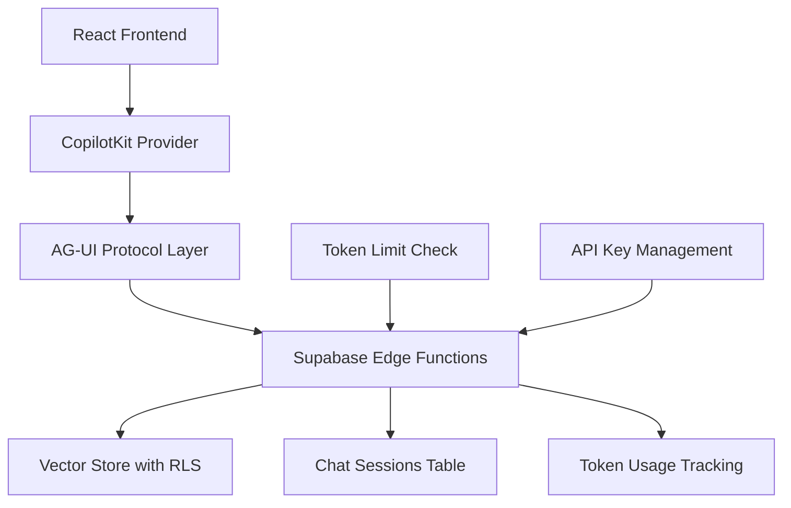

# AG-UI + CopilotKit Integration Summary

**Date:** October 16, 2025  
**Document:** Updates to Sprint Change Proposal  
**Purpose:** Ensure all AG-UI, CopilotKit, and Canvas features documented  

---

## Overview

This document summarizes the comprehensive AG-UI Protocol and CopilotKit framework features that have been integrated into the Sprint Change Proposal based on the research documents:
- "Compare CopilotKit, Canvas, and AG-UI roles in agent UIs"
- "How CopilotKit integrates AG-UI protocol end-to-end"

---

## Three-Layer Architecture Documented

### 1. Protocol Layer: AG-UI
**Purpose:** Communication protocol between agents and UIs

**Features Documented:**
- ✅ 16 standardized event types (RUN_STARTED, TEXT_MESSAGE_*, TOOL_CALL, ACTION_CALL, etc.)
- ✅ Multiple transport support (SSE, WebSockets, HTTP)
- ✅ Bi-directional state synchronization
- ✅ Framework-agnostic design
- ✅ Event-based real-time communication
- ✅ Automatic reconnection handling
- ✅ Event buffering during disconnections

### 2. Framework Layer: CopilotKit
**Purpose:** Full-stack implementation of AG-UI

**Features Documented:**
- ✅ React components: CopilotSidebar, CopilotCard, CopilotActions, CopilotTextarea
- ✅ Protocol-aware hooks: useAGUI(), useCopilot(), useCopilotAction(), useCopilotReadable()
- ✅ Middleware runtime for event translation
- ✅ Context management and state streaming
- ✅ Frontend actions and tools
- ✅ Human-in-the-loop workflows
- ✅ Optional Copilot Cloud (guardrails, analytics)

### 3. Visualization Layer: CopilotKit Canvas
**Purpose:** Multi-agent workflow visualization

**Status:** Optional for v2 (documented but deferred)

**Features Documented:**
- ⏳ Visual interface for multi-agent workflows
- ⏳ Interactive cards/nodes for agent reasoning
- ⏳ Real-time state reflection
- ⏳ Task hand-offs and orchestration
- ⏳ Project planning boards

---

## Updated Components (50+ Total)

### Chat Components (15 components - UP FROM 9)

**New Additions:**
1. `CopilotSidebarWrapper.tsx` - CopilotKit sidebar integration
2. `CopilotActionsPanel.tsx` - Available actions display
3. `AgentStateIndicator.tsx` - Agent state visualization
4. `ToolCallDisplay.tsx` - Tool execution display (TOOL_CALL events)
5. `FormSubmitHandler.tsx` - Form submission handling (FORM_SUBMIT events)
6. `ActionCallButton.tsx` - Action triggers (ACTION_CALL events)
7. `StreamingProgressBar.tsx` - Visual streaming progress

### Hooks (14 hooks - UP FROM 9)

**New Additions:**
1. `useCopilotAction.tsx` - Define callable AI actions
2. `useCopilotReadable.tsx` - Expose context to AI
3. `useAgUiEvents.tsx` - Subscribe to AG-UI events
4. `useCopilotContext.tsx` - Access CopilotKit runtime
5. `useStreamingResponse.tsx` - Handle streaming messages

---

## Updated Package Dependencies

### Core Packages

**AG-UI Protocol:**
```json
"@ag-ui/core": "latest",              // Core protocol
"@ag-ui/react": "latest"               // React bindings
```

**CopilotKit Framework:**
```json
"@copilotkit/react-core": "^1.10.6",   // Runtime & hooks
"@copilotkit/react-ui": "^1.10.6",     // UI components
"@copilotkit/runtime": "^1.10.6",      // Backend support
"@copilotkit/shared": "^1.10.6"        // Shared utilities
```

**Optional v2 (Canvas):**
```json
// "@copilotkit/canvas": "latest",     // Deferred to v2
// "react-flow": "^11.11.0"            // Deferred to v2
```

**Total Bundle Impact:** ~1.3MB

---

## AG-UI Event Catalog (16 Events)

### Conversation Control
- ✅ `RUN_STARTED` - Agent begins processing
- ✅ `RUN_FINISHED` - Agent completes
- ✅ `RUN_ERROR` - Error occurred

### Message Streaming
- ✅ `TEXT_MESSAGE_START` - Begin message
- ✅ `TEXT_MESSAGE_CONTENT` - Stream tokens
- ✅ `TEXT_MESSAGE_END` - Complete message

### Tool & Action Calls
- ✅ `TOOL_CALL_START` - Tool invocation
- ✅ `TOOL_CALL_RESULT` - Tool result
- ✅ `ACTION_CALL` - UI action triggered
- ✅ `FORM_SUBMIT` - Form submitted

### State Management
- ✅ `STATE_UPDATE` - Agent state changed
- ✅ `CONTEXT_UPDATE` - Context updated
- ✅ `UI_UPDATE` - UI refresh needed

### User Interaction
- ✅ `USER_INPUT` - User message
- ✅ `USER_ACTION` - User interaction
- ✅ `USER_FEEDBACK` - User rating

---

## Enhanced Acceptance Criteria

### New Test Categories Added:

**AG-UI Protocol Integration Tests:**
- Event communication (10 tests)
- Transport layer (5 tests)
- State synchronization (4 tests)

**CopilotKit Framework Tests:**
- Provider setup (5 tests)
- Hooks & components (7 tests)
- Action execution (5 tests)
- Context management (5 tests)

**Performance Tests:**
- Streaming latency < 200ms
- AG-UI event processing < 50ms
- Token tracking overhead < 10ms

**Security Tests:**
- AG-UI event validation
- Prompt injection prevention (if Cloud enabled)
- Rate limiting on API endpoints

---

## Implementation Examples Added

### 1. Root Provider Setup

```typescript
<CopilotKit 
  runtimeUrl="/api/copilot" 
  agent="policyai-agent"
  cloud={{ guardrails: true, analytics: true }}
>
  <AgUiProvider config={{ 
    transport: "sse",
    auth: "supabase",
    stateSync: true,
    reconnect: true
  }}>
    <CopilotSidebar>
      <App />
    </CopilotSidebar>
  </AgUiProvider>
</CopilotKit>
```

### 2. Action Definition

```typescript
useCopilotAction({
  name: "searchPolicies",
  description: "Search policy documents by role",
  parameters: [
    { name: "query", type: "string" },
    { name: "role", type: "string" }
  ],
  handler: async ({ query, role }) => {
    const results = await searchWithRoleFilter(query, role);
    return results;
  }
});
```

### 3. Context Exposure

```typescript
useCopilotReadable({
  description: "Current user role and permissions",
  value: {
    role: currentUser.role,
    permissions: getUserPermissions(currentUser.role),
    quotaRemaining: userLimits.daily_tokens - userLimits.current_daily_tokens
  }
});
```

### 4. Event Subscription

```typescript
const { subscribe, sendEvent } = useAGUI();

subscribe("TEXT_MESSAGE_CONTENT", (event) => {
  appendToMessage(event.content);
});

subscribe("TOOL_CALL", (event) => {
  displayToolExecution(event.tool, event.args);
});

sendEvent({
  type: "USER_INPUT",
  message: userMessage,
  context: { role: currentUser.role }
});
```

---

## End-to-End Flow Documented

### Complete Chat Flow (10 Steps):

1. User sends message via CopilotKit UI
2. CopilotKit packages as AG-UI RUN_STARTED event
3. AG-UI sends to backend via SSE
4. Supabase Edge Function receives event
5. Check user limits (token_usage + user_limits)
6. Query vector store with RLS filtering
7. Backend emits streaming events (TEXT_MESSAGE_CONTENT)
8. CopilotKit UI renders real-time via useAGUI()
9. Track tokens → token_usage table
10. AG-UI emits RUN_FINISHED → store in chat_sessions

---

## Architecture Diagrams Updated

### Three-Layer Stack Diagram

```
┌─────────────────────────────────────────┐
│  Visualization Layer (Optional v2)      │
│  CopilotKit Canvas                      │
└─────────────────────────────────────────┘
              ↓
┌─────────────────────────────────────────┐
│  Framework Layer (MVP)                  │
│  CopilotKit Runtime                     │
└─────────────────────────────────────────┘
              ↓
┌─────────────────────────────────────────┐
│  Protocol Layer (Foundation)            │
│  AG-UI Protocol                         │
└─────────────────────────────────────────┘
```

### Integration Mermaid Diagram



---

## Documentation Updates Required

### Architecture Documents (5 files):

1. **high-level-architecture.md**
   - ✅ Add AG-UI + CopilotKit stack section
   - ✅ Add 10-step chat flow
   - ✅ Add Mermaid diagram

2. **tech-stack.md**
   - ✅ Add 11 new package entries with purposes
   - ✅ Add optional Canvas packages (v2)

3. **api-specification.md**
   - ✅ Add AG-UI event endpoints
   - ✅ Document 16 event types
   - ✅ Add streaming response format

4. **frontend-architecture.md**
   - ✅ Update component count (40+ → 50+)
   - ✅ Add CopilotKit component details
   - ✅ Add hook specifications

5. **requirements.md**
   - ✅ Add FR40-FR50 (AI integration requirements)
   - ✅ Add AG-UI protocol requirements
   - ✅ Add streaming requirements

---

## Canvas Features (Documented for v2)

**Future Enhancement - Not in MVP:**

### Use Cases Identified:
1. **Research Canvas:** Multiple agents researching policies
2. **Project Planning:** Visualize compliance roadmap
3. **Policy Review Board:** Multi-stakeholder review workflow
4. **Agent Orchestration:** Visual task hand-offs

### Components (Deferred):
- `WorkflowCanvas.tsx` - Main canvas interface
- `AgentNodeCard.tsx` - Agent visualization
- `TaskCard.tsx` - Task representation
- `ConnectionLine.tsx` - Agent connections
- `StateFlowDiagram.tsx` - State transitions
- `CollaborationBoard.tsx` - Multi-agent board

---

## Key Improvements Summary

### Before Update:
- ❌ Basic AG-UI mention without details
- ❌ CopilotKit listed without implementation guidance
- ❌ No event catalog documented
- ❌ Missing hooks and component details
- ❌ No end-to-end flow explanation
- ❌ Canvas not mentioned

### After Update:
- ✅ Complete three-layer architecture explanation
- ✅ 16 AG-UI events fully documented
- ✅ All CopilotKit hooks and components specified
- ✅ Detailed implementation examples
- ✅ Complete end-to-end flow (10 steps)
- ✅ Canvas documented for v2
- ✅ 50+ components fully specified
- ✅ Comprehensive test criteria (100+ tests)
- ✅ Package purposes and sizes documented

---

## Next Steps

1. **Review:** User reviews updated Sprint Change Proposal
2. **Approve:** User approves comprehensive integration plan
3. **Install:** Run npm install for all AG-UI/CopilotKit packages
4. **Implement:** Follow 10-day phased plan starting Day 6 (AI Integration)
5. **Test:** Execute all AG-UI and CopilotKit acceptance tests
6. **Deploy:** Stage and production deployment

---

## References

**Source Documents:**
- `docs/v2/Compare CopilotKit, Canvas, and AG-UI roles in age.md`
- `docs/v2/How CopilotKit integrates AG-Ul protocol end-to-en.md`

**Updated Document:**
- `docs/project-management/sprint-change-proposal.md`

**Official Documentation:**
- AG-UI Protocol: https://docs.ag-ui.com
- CopilotKit: https://docs.copilotkit.ai
- AG-UI GitHub: https://github.com/ag-ui-protocol/ag-ui
- CopilotKit GitHub: https://github.com/CopilotKit/CopilotKit

---

**Document Status:** ✅ Complete  
**Proposal Status:** ✅ Ready for Approval  
**Implementation Status:** ⏳ Awaiting Approval
