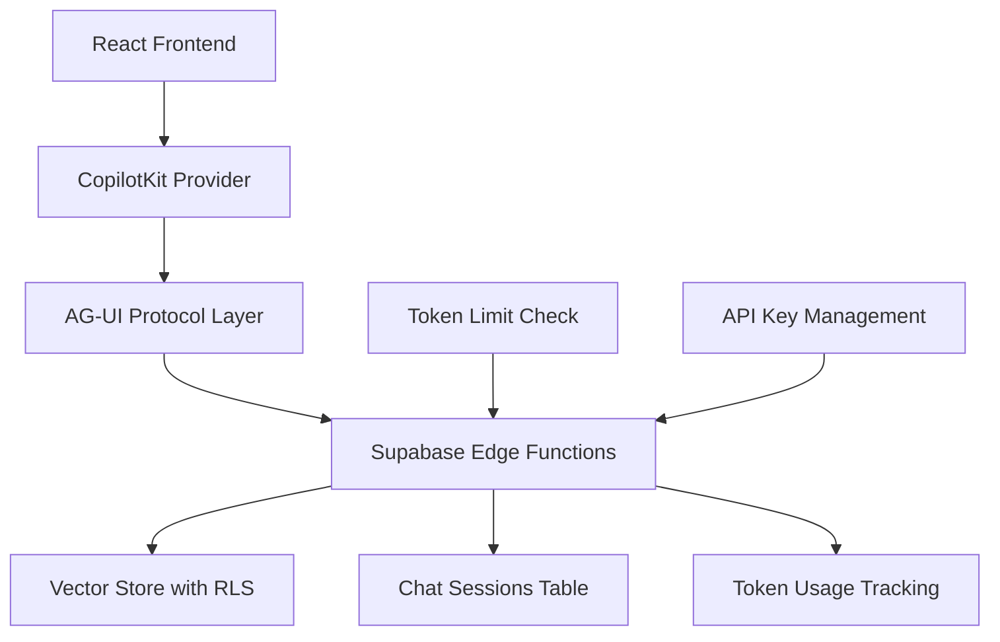

# Sprint Change Proposal: AG-UI + CopilotKit Integration & Role Hierarchy Expansion

**Document Version:** 1.0  
**Date:** October 16, 2025  
**Sprint Duration:** 2 weeks (10 working days)  
**Team Composition:** Solo Developer  
**Project:** PolicyAi - Compliance Management System  
**Branch:** HHR-120-login-role-hierarchy  

---

## Executive Summary

This Sprint Change Proposal documents a comprehensive enhancement to PolicyAi, transforming it from a basic 3-role document management system into a full-featured SaaS application with advanced AI capabilities. The changes encompass:

**Core Enhancements:**
1. **Role Hierarchy Expansion**: 3 → 5 roles (adding Company Operator, System Owner)
2. **AI Framework Integration**: AG-UI Protocol + CopilotKit for in-app AI chat
3. **n8n Migration**: Move chat workflows from external n8n to in-app implementation
4. **Token Usage System**: Comprehensive tracking and monitoring dashboard
5. **API Key Management**: Secure storage and user-configurable keys
6. **PDF Document Viewer**: Replace markdown viewer with full PDF rendering
7. **Enhanced UI/UX**: Dual navigation, settings hub, user management, token dashboard

**Scope:** MVP implementation in single 2-week sprint with phased approach

**Priority:** Week 1 (Foundation) → Week 2 (User-Facing Features)

---

## Table of Contents

1. [Change Trigger & Context](#1-change-trigger--context)
2. [Epic Impact Assessment](#2-epic-impact-assessment)
3. [Artifact Conflict Analysis](#3-artifact-conflict-analysis)
4. [Path Forward & Strategy](#4-path-forward--strategy)
5. [Proposed Changes](#5-proposed-changes)
6. [Implementation Timeline](#6-implementation-timeline)
7. [Success Criteria](#7-success-criteria)
8. [Risk Mitigation](#8-risk-mitigation)
9. [Approval & Next Steps](#9-approval--next-steps)

---

## 1. Change Trigger & Context

### 1.1 Triggering Story

**Current Branch:** `HHR-120-login-role-hierarchy`  
**Affected Epics:** Epic 1 (Core Application), Epic 2 (Executive Experience)  
**Related Stories:** 1.2 (Database Schema), 1.3 (Administrator Upload)

### 1.2 Issue Definition

**Type:** Missing Requirements + Functional Upgrade

**Core Requirements:**

#### A. Missing SaaS Features
1. **Two New Operational Roles:**
   - **Company Operator**: Manages user roles, uploads PDFs, configures API keys
   - **System Owner**: Full system access including user limits and system configuration

2. **API Key Management:**
   - Frontend UI for configuring OpenAI/Gemini/Mistral keys
   - Encrypted storage with AES-256
   - Per-user and organization-wide keys
   - Key testing and validation

3. **Token Usage Tracking:**
   - Track: requests, messages, evaluations, timestamps
   - Monitor: daily/monthly quotas
   - Dashboard: usage trends, cost projections
   - Limits: Configurable per-user limits

4. **User Management Interface:**
   - Role assignment UI
   - Bulk operations
   - Usage monitoring
   - Limit configuration

5. **PDF Document Viewer:**
   - Display actual PDFs instead of markdown
   - Citation highlighting
   - Page navigation and search
   - Thumbnail sidebar

#### B. Architectural Upgrades
1. **AI Framework Integration:**
   - AG-UI Protocol for agent-user interaction
   - CopilotKit for React-native copilot features
   - Supabase Platform Kit for enhanced UI components

2. **n8n Chat Migration:**
   - Move 3 role-based chat workflows into app
   - Maintain n8n for file processing (v2)
   - Real-time streaming responses
   - Role-based vector store filtering

3. **UI/UX Enhancements:**
   - Dual navigation bars (primary + secondary)
   - Settings wizard interface
   - Enhanced dashboard with new roles
   - Token usage visualization

### 1.3 Evidence & Current State

**What's Working:**
- ✅ Basic authentication with 3 roles (board, administrator, executive)
- ✅ Role-based document access with global source filtering
- ✅ Document upload and storage via Supabase
- ✅ n8n workflows for chat and file processing
- ✅ Vector embeddings for RAG

**Current Limitations:**
- ⚠️ Only 3 roles - no operational/management roles
- ⚠️ No API key management - users can't use their own keys
- ⚠️ No token usage tracking - no visibility into costs
- ⚠️ Chat depends on external n8n (latency, complexity)
- ⚠️ Markdown viewer only - no actual PDF display
- ⚠️ No user administration interface
- ⚠️ No settings/configuration UI

**Database State:**
```sql
Current Roles: board, administrator, executive
Missing Tables: api_keys, token_usage, user_limits, chat_sessions
Missing Columns: pdf_file_path, pdf_page_count, etc.
RLS Policies: Need updates for new roles
```

### 1.4 Impact Assessment

**Not Blocked:** Current development can continue  
**Functionality Gap:** Cannot deliver full SaaS without these features  
**UX Issue:** Document viewing suboptimal (markdown vs PDF)  
**Scalability:** n8n dependency limits real-time responsiveness  
**Scope:** MVP enhancement - all changes in this sprint

---

## 2. Epic Impact Assessment

### 2.1 Current Epic Analysis

#### **Epic 1: Core Application - Administrator Experience**

**Current Stories:**
- ✅ 1.1: Project Foundation/Rebranding (Complete)
- 🔄 1.2: Database Schema/Role Setup (Needs Extension)
- ✅ 1.3: Administrator Document Upload (Complete, needs PDF viewer)

**Impact:**
- **Story 1.2 Changes:**
  - ❌ BREAKING: Add 2 new roles
  - ❌ NEW TABLES: api_keys, token_usage, user_limits, chat_sessions
  - ❌ SCHEMA UPDATES: RLS policies for new roles
  - ⚠️ MIGRATION RISK: Medium (additive changes, no data loss)

- **Story 1.3 Enhancement:**
  - ⚠️ UI UPGRADE: PDF viewer replaces markdown
  - ⚠️ UX CHANGE: Dual navigation
  - ✅ MINOR IMPACT: Upload flow unchanged

#### **Epic 2: Executive Experience - Advanced RAG**

**Current State:** Not yet started

**Impact:**
- ⚠️ ARCHITECTURE CHANGE: n8n chat → AG-UI + CopilotKit
- ❌ NEW PATTERN: In-app AI vs external webhooks
- ⚠️ SCOPE CHANGE: Chat becomes core feature

### 2.2 New Epics Required

The analysis identified 4 new epics needed:

#### **Epic 1.5: Role Hierarchy & Access Control** (NEW)
**Priority:** CRITICAL - Foundation for everything else  
**Duration:** Days 1-2

**Stories:**
- 1.5.1: Add Company Operator & System Owner roles
- 1.5.2: Update RLS policies for 5-tier system
- 1.5.3: Role assignment UI
- 1.5.4: Permission management

**Dependencies:** Must complete before Epic 2

---

#### **Epic 1.7: SaaS Infrastructure** (NEW)
**Priority:** HIGH - Core SaaS features  
**Duration:** Days 1-5

**Stories:**
- 1.7.1: API Key Management (storage, encryption, UI)
- 1.7.2: Token Usage Tracking (comprehensive metrics)
- 1.7.3: Usage Dashboard & Monitoring
- 1.7.4: User Limits & Quota Management

**Dependencies:** Parallel with Epic 1.5

---

#### **Epic 2: AI-Powered Chat Experience** (MODIFIED)
**Priority:** HIGH - User-facing AI features  
**Duration:** Days 6-7

**Original:** "Advanced RAG Intelligence"  
**Modified:** Focus on AG-UI + CopilotKit integration

**Stories:**
- 2.1: AG-UI + CopilotKit Integration
- 2.2: Role-Based Chat Interface (replaces n8n)
- 2.3: Real-time Streaming Responses
- 2.4: Citation & Source Highlighting
- 2.5: Chat History & Favorites

**Dependencies:** Requires Epic 1.5 complete

---

#### **Epic 3: Enhanced Document Experience** (NEW)
**Priority:** MEDIUM - Document viewing  
**Duration:** Day 8

**Stories:**
- 3.1: PDF Document Viewer (react-pdf)
- 3.2: Dual Navigation System
- 3.3: Document Metadata Display
- 3.4: Search & Filter by Role

**Dependencies:** Can run parallel with Epic 2

---

#### **Epic 4: Settings & Administration** (NEW)
**Priority:** MEDIUM - Admin interfaces  
**Duration:** Days 5, 9-10

**Stories:**
- 4.1: Settings Wizard UI
- 4.2: API Key Configuration Interface
- 4.3: User Management Dashboard
- 4.4: Token Usage Monitoring

**Dependencies:** Requires Epics 1.5 and 1.7

---

### 2.3 Epic Dependency Chain

```
Epic 1.1 ✅ (Complete)
    ↓
Epic 1.2 🔄 (Extend) ──┬──→ Epic 1.5 (Role Hierarchy) ──┬──→ Epic 2 (AI Chat)
                       │                                  │
                       └──→ Epic 1.7 (SaaS Infrastructure)├──→ Epic 3 (Documents)
                                                          │
                                                          └──→ Epic 4 (Admin UI)
```

---

## 3. Artifact Conflict Analysis

### 3.1 Architecture Documents

#### **high-level-architecture.md**

**CONFLICTS:**

❌ **Current Architecture:**
```
React SPA → Supabase Edge Functions → N8N Workflows → Postgres
```

❌ **Required Architecture:**
```
React SPA → AG-UI + CopilotKit → Supabase Functions → Postgres
          ↓
    Token Tracking, API Keys, Limits
```

**Changes Needed:**
- Add AG-UI Protocol layer
- Add CopilotKit provider layer
- Document n8n chat migration path
- Add token tracking flow
- Add API key management flow

**Compatible:**
- ✅ File processing stays in n8n
- ✅ Supabase as foundation unchanged

---

#### **tech-stack.md**

**MISSING ENTRIES:**

```markdown
| AI Framework | AG-UI Protocol | latest | Agent-user interaction |
| AI Framework | CopilotKit | latest | In-app AI copilot |
| UI Component | @supabase/ui | latest | Supabase Platform Kit |
| PDF Viewer | react-pdf | ^7.7.0 | Document rendering |
| Charts | Recharts | ^2.12.7 | Token visualization |
| Encryption | crypto-js | ^4.2.0 | API key encryption |
```

---

#### **api-specification.md**

**MISSING ROLES:**
- Current: board, administrator, executive
- Required: + company_operator, system_owner

**MISSING ENDPOINTS:**

```typescript
// API Key Management
POST   /api/settings/api-keys
GET    /api/settings/api-keys
DELETE /api/settings/api-keys/:id
PUT    /api/settings/api-keys/:id/test

// Token Usage Tracking
GET    /api/admin/token-usage
GET    /api/admin/token-usage/:userId
POST   /api/admin/token-usage/track
GET    /api/admin/token-usage/summary

// User Management (Enhanced)
GET    /api/admin/users
POST   /api/admin/users/:id/role
POST   /api/admin/users/:id/limits
GET    /api/admin/users/:id/usage
POST   /api/admin/users/bulk-action

// Chat (Native - replacing n8n)
POST   /api/chat/stream
GET    /api/chat/sessions
GET    /api/chat/sessions/:id/messages
POST   /api/chat/sessions/:id/favorite
DELETE /api/chat/sessions/:id
```

**AUTHORIZATION MATRIX UPDATE:**

| Endpoint | Board | Admin | Executive | Company Op | System Owner |
|----------|-------|-------|-----------|------------|--------------|
| User Mgmt | ✅ | ❌ | ❌ | ✅ Limited | ✅ Full |
| API Keys | ❌ | ❌ | ❌ | ✅ | ✅ |
| Token Usage | ❌ | ❌ | ❌ | ✅ View | ✅ Full |
| Doc Upload | ✅ | ✅ | ❌ | ✅ | ✅ |
| User Limits | ❌ | ❌ | ❌ | ❌ | ✅ |
| Chat | ✅ | ✅ | ✅ | ✅ | ✅ |

---

#### **frontend-architecture.md**

**CONFLICTS:**

❌ **Current:** "three user roles"  
✅ **Required:** Five user roles with clear hierarchy

❌ **Current:** n8n-based chat  
✅ **Required:** In-app AG-UI + CopilotKit chat

**MISSING COMPONENTS (40+ new):**

```typescript
// Administration & Settings (10 components)
components/admin/UserManagementDashboard.tsx
components/admin/UserTable.tsx
components/admin/RoleAssignmentDialog.tsx
components/admin/UserLimitEditor.tsx
components/admin/BulkActionBar.tsx
components/settings/SettingsHub.tsx
components/settings/ApiKeyManager.tsx
components/settings/ApiKeyDialog.tsx
components/settings/KeyTestInterface.tsx
components/settings/EncryptionIndicator.tsx

// Token Usage & Monitoring (6 components)
components/monitoring/TokenUsageDashboard.tsx
components/monitoring/UsageOverviewCard.tsx
components/monitoring/UserUsageTable.tsx
components/monitoring/TokenTrendChart.tsx
components/monitoring/UsageAlertBanner.tsx
components/monitoring/CostProjectionWidget.tsx

// Document Viewing (6 components)
components/document/PdfViewer.tsx
components/document/PdfNavigationBar.tsx
components/document/PdfThumbnailSidebar.tsx
components/document/PdfSearchBar.tsx
components/document/CitationHighlighter.tsx
components/document/DocumentMetadataPanel.tsx

// Navigation (5 components)
components/navigation/PrimaryNavigationBar.tsx
components/navigation/SecondaryNavigationBar.tsx
components/navigation/NavigationBreadcrumb.tsx
components/navigation/QuickAccessMenu.tsx
components/navigation/NotificationBadge.tsx

// Chat (AG-UI + CopilotKit) (15+ components)
components/chat/AgUiChatProvider.tsx           // AG-UI protocol context
components/chat/CopilotKitProvider.tsx         // CopilotKit runtime wrapper
components/chat/StreamingChatInterface.tsx     // Main chat UI with streaming
components/chat/MessageBubble.tsx              // Individual message display
components/chat/CitationInline.tsx             // In-message citations
components/chat/ChatInputBar.tsx               // Enhanced input with CopilotTextarea
components/chat/TypingIndicator.tsx            // Real-time streaming indicator
components/chat/ChatHistorySidebar.tsx         // Previous chat sessions
components/chat/ContextDocumentsList.tsx       // Active documents in context
components/chat/CopilotSidebarWrapper.tsx      // CopilotKit sidebar component
components/chat/CopilotActionsPanel.tsx        // Available actions display
components/chat/AgentStateIndicator.tsx        // Current agent state visualization
components/chat/ToolCallDisplay.tsx            // Show tool execution (TOOL_CALL events)
components/chat/FormSubmitHandler.tsx          // Handle FORM_SUBMIT events
components/chat/ActionCallButton.tsx           // Trigger ACTION_CALL events
components/chat/StreamingProgressBar.tsx       // Visual progress during streaming

// Hooks (14 new hooks)
hooks/useTokenUsage.tsx                        // Token tracking
hooks/useApiKeys.tsx                           // Key management
hooks/useUserLimits.tsx                        // Quota checks
hooks/useAgUiChat.tsx                          // AG-UI protocol integration
hooks/useCopilotKit.tsx                        // CopilotKit integration
hooks/useCopilotAction.tsx                     // Define agent actions
hooks/useCopilotReadable.tsx                   // Expose context to AI
hooks/useUserManagement.tsx                    // User operations
hooks/usePdfViewer.tsx                         // PDF operations
hooks/useRolePermissions.tsx                   // Permission checks
hooks/useTokenMonitoring.tsx                   // Real-time monitoring
hooks/useAgUiEvents.tsx                        // Subscribe to AG-UI events
hooks/useCopilotContext.tsx                    // Access CopilotKit context
hooks/useStreamingResponse.tsx                 // Handle streaming messages
```

**CopilotKit Component Architecture Details:**

```typescript
// 1. Provider Setup (Root Level)
<CopilotKit 
  runtimeUrl="/api/copilot"
  agent="policyai-agent"
  cloud={{ guardrails: true, analytics: true }}
>
  <AgUiProvider config={{ transport: "sse" }}>
    <CopilotSidebar>  {/* Pre-built sidebar */}
      <App />
    </CopilotSidebar>
  </AgUiProvider>
</CopilotKit>

// 2. Action Definition (Backend Callable)
useCopilotAction({
  name: "searchPolicies",
  description: "Search policy documents",
  parameters: [
    { name: "query", type: "string", required: true },
    { name: "role", type: "string", enum: ["board", "administrator", "executive"] }
  ],
  handler: async ({ query, role }) => {
    // Query with RLS filtering
    const results = await supabase
      .from('documents')
      .select('*')
      .textSearch('content', query)
      .eq('accessible_by_role', role);
    return results;
  }
});

// 3. Context Exposure (Make Data Readable to AI)
useCopilotReadable({
  description: "Current user role and permissions",
  value: {
    role: currentUser.role,
    permissions: getUserPermissions(currentUser.role),
    quotaRemaining: userLimits.daily_tokens - userLimits.current_daily_tokens
  }
});

// 4. Chat Components (CopilotKit Pre-built)
import { 
  CopilotSidebar,      // Side panel chat
  CopilotPopup,        // Popup chat window
  CopilotTextarea,     // Enhanced input with AI
  CopilotCard          // Display agent cards
} from "@copilotkit/react-ui";

// 5. AG-UI Event Handling
import { useAGUI } from "@ag-ui/react";

const { events, sendEvent, subscribe } = useAGUI();

// Subscribe to specific events
subscribe("TEXT_MESSAGE_CONTENT", (event) => {
  // Handle streaming tokens
  appendToMessage(event.content);
});

subscribe("TOOL_CALL", (event) => {
  // Show tool execution
  displayToolExecution(event.tool, event.args);
});

subscribe("STATE_UPDATE", (event) => {
  // Update agent state display
  updateAgentState(event.state);
});

// Send events to backend
sendEvent({
  type: "USER_INPUT",
  message: userMessage,
  context: {
    role: currentUser.role,
    notebook_id: activeNotebook.id
  }
});
```

**Canvas Components (Optional v2 - Multi-Agent Workflow Visualization):**

```typescript
// Future Enhancement - Not in MVP
components/canvas/WorkflowCanvas.tsx           // Main canvas interface
components/canvas/AgentNodeCard.tsx            // Agent as visual node
components/canvas/TaskCard.tsx                 // Task representation
components/canvas/ConnectionLine.tsx           // Agent connections
components/canvas/StateFlowDiagram.tsx         // State transitions
components/canvas/CollaborationBoard.tsx       // Multi-agent board

// Canvas Use Cases (v2):
// - Research Canvas: Multiple agents researching policies
// - Project Planning: Visualize compliance roadmap
// - Policy Review Board: Multi-stakeholder review workflow
```

---

### 3.2 Database Schema

#### **Current Schema:**

**Existing Tables:**
1. ✅ profiles
2. ✅ user_roles (3 roles only)
3. ✅ notebooks
4. ✅ sources
5. ✅ documents (vector)
6. ✅ notes
7. ✅ n8n_chat_histories

#### **Required Changes:**

**1. Role Constraint Update:**
```sql
-- Current
CHECK (role IN ('administrator', 'executive', 'board'))

-- Required
CHECK (role IN ('administrator', 'executive', 'board', 'company_operator', 'system_owner'))
```

**2. Six New Tables:**

```sql
-- Table 1: api_keys (Encrypted API key storage)
CREATE TABLE public.api_keys (
  id UUID PRIMARY KEY,
  user_id UUID REFERENCES auth.users(id),
  provider TEXT CHECK (provider IN ('openai', 'gemini', 'mistral', 'anthropic')),
  encrypted_key TEXT NOT NULL,
  key_hash TEXT NOT NULL,
  is_active BOOLEAN DEFAULT true,
  is_default BOOLEAN DEFAULT false,
  usage_count INTEGER DEFAULT 0,
  last_used_at TIMESTAMPTZ,
  created_at TIMESTAMPTZ DEFAULT NOW()
);

-- Table 2: token_usage (Comprehensive usage tracking)
CREATE TABLE public.token_usage (
  id UUID PRIMARY KEY,
  user_id UUID NOT NULL REFERENCES auth.users(id),
  session_id TEXT,
  request_type TEXT,
  prompt_tokens INTEGER DEFAULT 0,
  completion_tokens INTEGER DEFAULT 0,
  total_tokens INTEGER DEFAULT 0,
  model_used TEXT,
  provider TEXT,
  message_count INTEGER DEFAULT 1,
  evaluation_count INTEGER DEFAULT 0,
  evaluation_score DECIMAL(3,2),
  request_timestamp TIMESTAMPTZ DEFAULT NOW(),
  response_timestamp TIMESTAMPTZ,
  duration_ms INTEGER,
  status TEXT,
  estimated_cost_usd DECIMAL(10,6),
  metadata JSONB DEFAULT '{}'::jsonb
);

-- Table 3: user_limits (Quota management)
CREATE TABLE public.user_limits (
  id UUID PRIMARY KEY,
  user_id UUID NOT NULL REFERENCES auth.users(id) UNIQUE,
  daily_token_limit INTEGER DEFAULT 100000,
  monthly_token_limit INTEGER DEFAULT 1000000,
  daily_request_limit INTEGER DEFAULT 100,
  monthly_request_limit INTEGER DEFAULT 1000,
  current_daily_tokens INTEGER DEFAULT 0,
  current_monthly_tokens INTEGER DEFAULT 0,
  current_daily_requests INTEGER DEFAULT 0,
  current_monthly_requests INTEGER DEFAULT 0,
  daily_reset_at TIMESTAMPTZ,
  monthly_reset_at TIMESTAMPTZ,
  is_unlimited BOOLEAN DEFAULT false,
  is_suspended BOOLEAN DEFAULT false
);

-- Table 4: chat_sessions (Native chat - replaces n8n)
CREATE TABLE public.chat_sessions (
  id UUID PRIMARY KEY,
  user_id UUID NOT NULL REFERENCES auth.users(id),
  notebook_id UUID REFERENCES public.notebooks(id),
  title TEXT,
  description TEXT,
  agent_state JSONB DEFAULT '{}'::jsonb,
  context_data JSONB DEFAULT '{}'::jsonb,
  is_favorite BOOLEAN DEFAULT false,
  is_pinned BOOLEAN DEFAULT false,
  message_count INTEGER DEFAULT 0,
  total_tokens_used INTEGER DEFAULT 0,
  created_at TIMESTAMPTZ DEFAULT NOW(),
  last_message_at TIMESTAMPTZ
);

-- Table 5: chat_messages (Individual messages)
CREATE TABLE public.chat_messages (
  id UUID PRIMARY KEY,
  session_id UUID NOT NULL REFERENCES public.chat_sessions(id),
  role TEXT CHECK (role IN ('user', 'assistant', 'system', 'tool')),
  content TEXT NOT NULL,
  citations JSONB DEFAULT '[]'::jsonb,
  sources JSONB DEFAULT '[]'::jsonb,
  prompt_tokens INTEGER DEFAULT 0,
  completion_tokens INTEGER DEFAULT 0,
  total_tokens INTEGER DEFAULT 0,
  message_index INTEGER,
  user_rating INTEGER CHECK (user_rating BETWEEN 1 AND 5),
  was_helpful BOOLEAN,
  tool_calls JSONB DEFAULT '[]'::jsonb,
  created_at TIMESTAMPTZ DEFAULT NOW()
);

-- Table 6: Enhanced sources (PDF support)
ALTER TABLE public.sources
ADD COLUMN pdf_file_path TEXT,
ADD COLUMN pdf_storage_bucket TEXT DEFAULT 'policy-documents',
ADD COLUMN pdf_file_size BIGINT,
ADD COLUMN pdf_page_count INTEGER,
ADD COLUMN pdf_metadata JSONB DEFAULT '{}'::jsonb;
```

**3. RLS Policy Updates:**

36 new RLS policies required for:
- New roles (company_operator, system_owner)
- New tables (api_keys, token_usage, user_limits, chat_sessions, chat_messages)
- Enhanced permissions on existing tables

**4. Helper Functions:**

15 new database functions:
- `check_user_limits()` - Verify quota before request
- `update_user_usage()` - Update usage counters
- `reset_daily_limits()` - Cron job for daily reset
- `reset_monthly_limits()` - Cron job for monthly reset
- `get_source_pdf_url()` - Generate signed PDF URLs
- `extract_pdf_metadata()` - Store PDF info
- Plus triggers for automatic timestamp and counter updates

---

### 3.3 UI/UX Specification

#### **MISSING USER PERSONAS:**

**Current:** Administrators, Executives

**Required:**
1. **System Owner**: Full system control, user management
2. **Company Operator**: Operations, API keys, role assignment
3. **Policy Administrator**: Document upload/management
4. **Executive**: Policy consumption
5. **Board Member**: Full visibility

#### **MISSING SCREENS & FLOWS:**

**New Screens (7 major):**
1. Settings Hub
2. API Key Management
3. User Management Dashboard
4. Token Usage Dashboard
5. PDF Document Viewer
6. Enhanced Chat Interface
7. Dual Navigation System

**New User Flows (5):**
1. Company Operator → Configure API Key
2. System Owner → Set User Limits
3. Company Operator → Monitor Token Usage
4. User → View PDF with Citation
5. User → Native Chat with Streaming

---

## 4. Path Forward & Strategy

### 4.1 Technical Strategy

#### **AG-UI + CopilotKit Integration**

**Why Both Frameworks?**

**AG-UI Protocol (Communication Layer):**
- ✅ Open, lightweight, event-based protocol for agent↔UI synchronization
- ✅ Standardizes 16 event types (RUN_STARTED, TEXT_MESSAGE_START, TEXT_MESSAGE_CONTENT, TEXT_MESSAGE_END, TOOL_CALL, ACTION_CALL, FORM_SUBMIT, STATE_UPDATE, RUN_FINISHED, etc.)
- ✅ Supports multiple transports: SSE (Server-Sent Events), WebSockets, HTTP
- ✅ Framework-agnostic - works with LangGraph, CrewAI, Mastra, LlamaIndex, AG2
- ✅ Bi-directional communication - agents push updates, UI streams back user actions
- ✅ Role-based filtering (perfect for our multi-role use case)
- ✅ Built for real-time state synchronization between backend agents and frontend

**CopilotKit (Framework & Runtime Layer):**
- ✅ Full-stack implementation of AG-UI protocol
- ✅ Ready-made React components: `CopilotSidebar`, `CopilotCard`, `CopilotActions`
- ✅ Protocol-aware hooks: `useAGUI()`, `useCopilot()`, `useCopilotAction()`
- ✅ Middleware runtime for translating agent outputs into AG-UI event sequences
- ✅ Frontend actions and tools for human-in-the-loop workflows
- ✅ Pre-built chat interfaces with streaming support
- ✅ Automatic context management and state streaming
- ✅ Optional Copilot Cloud for governance, analytics, and human feedback

**CopilotKit Canvas (Visualization Layer - Optional for v2):**
- ✅ Visual interface for multi-agent workflows
- ✅ Represents agent reasoning as interactive cards/nodes
- ✅ Real-time reflection of agent state and progress
- ✅ Supports task hand-offs and multi-agent orchestration
- ✅ Ideal for project planning, research assistants, design boards
- ⚠️ **Note:** Canvas is optional for v2 - MVP will use traditional chat interface

**Three-Layer Architecture:**

```typescript
┌─────────────────────────────────────────────────────┐
│  Visualization Layer (Optional v2)                  │
│  ┌─────────────────────────────────────────────┐   │
│  │ CopilotKit Canvas                           │   │
│  │ - Multi-agent workflow visualization        │   │
│  │ - Interactive cards/nodes                   │   │
│  │ - Project planning boards                   │   │
│  └─────────────────────────────────────────────┘   │
└─────────────────────────────────────────────────────┘
                        ↓
┌─────────────────────────────────────────────────────┐
│  Framework Layer (MVP)                              │
│  ┌─────────────────────────────────────────────┐   │
│  │ CopilotKit Runtime                          │   │
│  │ - React components & hooks                  │   │
│  │ - Middleware for event translation          │   │
│  │ - Context management                        │   │
│  │ - State streaming                           │   │
│  └─────────────────────────────────────────────┘   │
└─────────────────────────────────────────────────────┘
                        ↓
┌─────────────────────────────────────────────────────┐
│  Protocol Layer (Foundation)                        │
│  ┌─────────────────────────────────────────────┐   │
│  │ AG-UI Protocol                              │   │
│  │ - 16 standardized event types               │   │
│  │ - SSE/WebSocket/HTTP transports             │   │
│  │ - Bi-directional state sync                 │   │
│  │ - Framework-agnostic                        │   │
│  └─────────────────────────────────────────────┘   │
└─────────────────────────────────────────────────────┘
```

**Integration Architecture:**

```typescript
// Root Provider Setup (App.tsx)
import { CopilotKit } from "@copilotkit/react-core";
import { CopilotSidebar } from "@copilotkit/react-ui";
import { AgUiProvider } from "@ag-ui/react";

<CopilotKit 
  runtimeUrl="/api/copilot" 
  agent="policyai-agent"
  cloud={{
    guardrails: true,  // Optional: Prompt injection prevention
    analytics: true     // Optional: Usage analytics
  }}
>
  <AgUiProvider 
    config={{ 
      transport: "sse",           // Server-Sent Events for streaming
      auth: "supabase",           // Supabase auth integration
      stateSync: true,            // Automatic state synchronization
      reconnect: true             // Auto-reconnect on disconnect
    }}
  >
    <CopilotSidebar>
      <App />
    </CopilotSidebar>
  </AgUiProvider>
</CopilotKit>

// AG-UI Event Flow (End-to-End)
1. User sends message via CopilotKit UI
   ↓
2. CopilotKit packages as AG-UI event: RUN_STARTED
   ↓
3. AG-UI protocol sends to backend via SSE
   ↓
4. Supabase Edge Function receives event
   ↓
5. Check user limits (token_usage + user_limits tables)
   ↓
6. Query vector store with RLS-filtered role access
   ↓
7. Backend emits AG-UI events:
   - TEXT_MESSAGE_START (conversation begins)
   - TEXT_MESSAGE_CONTENT (streaming tokens)
   - TOOL_CALL (if retrieving documents)
   - STATE_UPDATE (agent progress)
   - TEXT_MESSAGE_END (message complete)
   ↓
8. CopilotKit UI renders real-time using useAGUI()
   ↓
9. Track tokens → token_usage table
   ↓
10. AG-UI emits RUN_FINISHED event
   ↓
11. Store in chat_sessions/chat_messages tables

// Example: CopilotKit Components in Use
import { 
  useCopilotAction,
  useCopilotReadable,
  CopilotTextarea 
} from "@copilotkit/react-core";

// Define actions the AI can call
useCopilotAction({
  name: "searchPolicies",
  description: "Search policy documents by role",
  parameters: [
    { name: "query", type: "string" },
    { name: "role", type: "string" }
  ],
  handler: async ({ query, role }) => {
    // Query Supabase with RLS filtering
    const results = await searchWithRoleFilter(query, role);
    return results;
  }
});

// Make context readable to AI
useCopilotReadable({
  description: "Current user role and permissions",
  value: currentUser.role
});
```

**AG-UI Event Catalog (16 Standard Events):**

```typescript
// Conversation Control
- RUN_STARTED          // Agent begins processing
- RUN_FINISHED         // Agent completes processing
- RUN_ERROR            // Error occurred

// Message Streaming
- TEXT_MESSAGE_START   // Begin new message
- TEXT_MESSAGE_CONTENT // Stream message tokens
- TEXT_MESSAGE_END     // Message complete

// Tool & Action Calls
- TOOL_CALL_START      // Agent calling tool
- TOOL_CALL_RESULT     // Tool returned result
- ACTION_CALL          // UI action triggered
- FORM_SUBMIT          // Form data submitted

// State Management
- STATE_UPDATE         // Agent state changed
- CONTEXT_UPDATE       // Context changed
- UI_UPDATE            // UI should refresh

// User Interaction
- USER_INPUT           // User typed message
- USER_ACTION          // User clicked button
- USER_FEEDBACK        // User rating/feedback
```

---

#### **n8n Chat Migration Strategy**

**Current n8n Workflow:**
```
Webhook → AI Agent → Vector Store (role-filtered) → Response
          ↓
     Postgres Memory
```

**New In-App Flow:**
```
CopilotKit → AG-UI → Supabase Edge Function → 
  Vector Query (RLS) → Stream → Chat_Messages Table
```

**Migration Approach:**

1. **Week 1:** Build parallel AG-UI system (n8n stays active)
2. **Week 2:** Route 50% traffic to AG-UI, monitor performance
3. **Post-Sprint:** Full cutover, keep n8n as fallback

**What Stays in n8n:**
- ✅ File processing workflow (Extract Text)
- ✅ Document embedding workflow (Upsert to Vector Store)
- ✅ Notebook generation workflow

---

#### **PDF Viewer Selection: react-pdf**

**Comparison:**

| Feature | react-pdf | pdfjs-dist | @react-pdf/renderer |
|---------|-----------|------------|---------------------|
| Size | 130KB | 200KB | 90KB |
| Features | ⭐⭐⭐⭐⭐ | ⭐⭐⭐⭐ | ⭐⭐ |
| Citations | ✅ Selection | ✅ Annotations | ❌ |
| React | ✅ Native | ⚠️ Wrapper | ✅ Native |

**Selected: react-pdf v7.7.0**

**Reasons:**
1. ✅ Built for React
2. ✅ Text selection (citations)
3. ✅ Page-by-page rendering
4. ✅ Built-in search
5. ✅ Strong community

---

#### **API Key Encryption Strategy**

**Approach:** AES-256 + SHA-256

```typescript
import CryptoJS from 'crypto-js';

// Encryption
const encrypted = CryptoJS.AES.encrypt(
  apiKey, 
  ENCRYPTION_KEY
).toString();

const hash = CryptoJS.SHA256(apiKey).toString();

// Storage
{
  encrypted_key: encrypted, // Never expose
  key_hash: hash            // For verification
}
```

**Security:**
1. ✅ Encryption key in environment
2. ✅ Hash for verification
3. ✅ Never send decrypted keys to frontend
4. ✅ Audit log for usage
5. ✅ Periodic key rotation

---

### 4.2 Phased Implementation Plan

**Sprint Duration:** 10 days  
**Team:** Solo developer  
**Priority:** Option A (Roles + Token → AI Chat → UI)

#### **Week 1: Foundation (Days 1-5)**

**Day 1:** Database Schema & Migrations
- 6 migration files
- RLS policy updates
- Helper functions
- *Est: 6-8 hours*

**Day 2:** API Key Management Backend
- Encryption utilities
- Supabase functions
- Edge Function endpoints
- *Est: 6-8 hours*

**Day 3:** Token Usage Tracking System
- Usage tracking hooks
- Limit enforcement
- Automatic counting
- *Est: 6-8 hours*

**Day 4:** User Management Backend
- Role assignment functions
- Limits management
- Bulk operations API
- *Est: 6-8 hours*

**Day 5:** Settings UI & API Key Management
- Settings Hub component
- API Key Manager UI
- Key testing interface
- *Est: 6-8 hours*

---

#### **Week 2: Features (Days 6-10)**

**Day 6:** AG-UI + CopilotKit Integration
- Install frameworks
- Configure providers
- Basic chat interface
- Streaming responses
- *Est: 6-8 hours*

**Day 7:** Chat Interface & Migration
- Streaming chat UI
- Message components
- Chat history sidebar
- Role-based filtering
- *Est: 6-8 hours*

**Day 8:** PDF Viewer & Documents
- react-pdf integration
- PDF navigation
- Citation highlighting
- Document metadata
- *Est: 6-8 hours*

**Day 9:** Admin Dashboards
- User Management UI
- Token Usage Dashboard
- Recharts integration
- Bulk operations
- *Est: 6-8 hours*

**Day 10:** Navigation & Polish
- Dual navigation bars
- Breadcrumbs
- Testing & debugging
- Deploy to staging
- *Est: 6-8 hours*

---

## 5. Proposed Changes

### 5.1 Database Migrations (CREATED)

**6 Migration Files Created:**

1. ✅ `20251016145126_extend_user_roles_for_operators.sql`
   - Extends user_roles constraint to 5 roles
   - Updates policy_documents and sources constraints
   - Adds 8 new RLS policies for new roles
   - Creates indexes for company_operator and system_owner

2. ✅ `20251016145127_create_api_keys_table.sql`
   - Creates api_keys table with encryption fields
   - 10 indexes for performance
   - 7 RLS policies (user access + operator management)
   - Triggers for updated_at and default key enforcement
   - Comments for security documentation

3. ✅ `20251016145128_create_token_usage_tracking.sql`
   - Creates comprehensive token_usage table
   - 12 indexes including composite indexes
   - 5 RLS policies (user view + operator monitoring)
   - Triggers for duration calculation and API key stats
   - View: daily_token_usage_summary

4. ✅ `20251016145129_create_user_limits_table.sql`
   - Creates user_limits table with quota management
   - 5 RLS policies for system owner control
   - Functions: check_user_limits, update_user_usage
   - Functions: reset_daily_limits, reset_monthly_limits
   - Trigger for automatic default limits on new users

5. ✅ `20251016145130_create_native_chat_sessions.sql`
   - Creates chat_sessions table (AG-UI compatible)
   - Creates chat_messages table with citations
   - 15 indexes across both tables
   - 10 RLS policies (user access + operator monitoring)
   - Triggers for automatic counters and indexes
   - View: chat_session_summaries

6. ✅ `20251016145131_enhance_sources_for_pdf_storage.sql`
   - Adds 5 PDF-related columns to sources
   - Function: get_source_pdf_url (signed URLs)
   - Function: extract_pdf_metadata
   - View: sources_with_pdf_access
   - Updates existing sources with PDF data

**Total:**
- 6 tables created/modified
- 50+ indexes
- 36 RLS policies
- 15 helper functions
- 3 views

---

### 5.2 Package Dependencies

**New Dependencies to Install:**

```json
{
  "dependencies": {
    // Existing dependencies remain...
    
    // ============================================
    // AG-UI Protocol & CopilotKit Stack
    // ============================================
    
    // AG-UI Protocol Layer (Communication)
    "@ag-ui/core": "latest",              // Core AG-UI protocol
    "@ag-ui/react": "latest",              // React bindings for AG-UI
    
    // CopilotKit Framework Layer (Runtime)
    "@copilotkit/react-core": "^1.10.6",   // Core runtime, hooks, context
    "@copilotkit/react-ui": "^1.10.6",     // Pre-built UI components
    "@copilotkit/runtime": "^1.10.6",      // Backend runtime for Edge Functions
    "@copilotkit/shared": "^1.10.6",       // Shared types and utilities
    
    // Optional: CopilotKit Canvas (v2 - Multi-Agent Visualization)
    // "@copilotkit/canvas": "latest",      // Canvas components (defer to v2)
    // "react-flow": "^11.11.0",            // Flow diagram library (defer to v2)
    
    // ============================================
    // Supabase Platform Kit
    // ============================================
    "@supabase/ui": "latest",              // Enhanced Supabase UI components
    
    // ============================================
    // PDF Viewer
    // ============================================
    "react-pdf": "^7.7.0",                 // React PDF viewer
    "pdfjs-dist": "^3.11.174",             // PDF.js worker library
    
    // ============================================
    // Data Visualization
    // ============================================
    "recharts": "^2.12.7",                 // Charts for token dashboard
    
    // ============================================
    // Encryption & Security
    // ============================================
    "crypto-js": "^4.2.0",                 // AES-256 encryption
    "@types/crypto-js": "^4.2.1",          // TypeScript types
    
    // ============================================
    // Utilities (Already Included)
    // ============================================
    // "date-fns": "^3.6.0",               // Date utilities
    // "zod": "^3.23.8"                    // Schema validation
  }
}
```

**Installation Commands:**

```bash
# Core AG-UI + CopilotKit Stack
npm install @ag-ui/core @ag-ui/react
npm install @copilotkit/react-core @copilotkit/react-ui @copilotkit/runtime @copilotkit/shared

# Supabase Platform Kit
npm install @supabase/ui

# PDF Viewer
npm install react-pdf pdfjs-dist

# Charts & Visualization
npm install recharts

# Encryption
npm install crypto-js @types/crypto-js

# All-in-One Command
npm install @ag-ui/core @ag-ui/react @copilotkit/react-core @copilotkit/react-ui @copilotkit/runtime @copilotkit/shared @supabase/ui react-pdf pdfjs-dist recharts crypto-js @types/crypto-js
```

**Package Purposes:**

| Package | Purpose | Size | Priority |
|---------|---------|------|----------|
| @ag-ui/core | AG-UI protocol implementation | ~50KB | CRITICAL |
| @ag-ui/react | React hooks for AG-UI events | ~30KB | CRITICAL |
| @copilotkit/react-core | Runtime, hooks, context management | ~120KB | CRITICAL |
| @copilotkit/react-ui | Pre-built chat components | ~80KB | HIGH |
| @copilotkit/runtime | Backend Edge Function support | ~60KB | CRITICAL |
| @copilotkit/shared | Shared types and utilities | ~20KB | HIGH |
| @supabase/ui | Enhanced Supabase components | ~100KB | MEDIUM |
| react-pdf | PDF rendering | ~130KB | HIGH |
| pdfjs-dist | PDF.js worker | ~200KB | HIGH |
| recharts | Token usage charts | ~400KB | MEDIUM |
| crypto-js | API key encryption | ~100KB | CRITICAL |

**Total Bundle Size Impact:** ~1.3MB (acceptable for SaaS app)

**Dev Dependencies (Already Included):**
- TypeScript 5.5.3
- Vite 5.4.1
- ESLint
- Tailwind CSS
  "dependencies": {
    // Existing dependencies remain...
    
    // AI Frameworks
    "@copilotkit/react-core": "^1.10.6",
    "@copilotkit/react-ui": "^1.10.6",
    "@copilotkit/runtime": "^1.10.6",
    "@ag-ui/react": "latest",
    "@ag-ui/core": "latest",
    
    // Supabase Platform Kit
    "@supabase/ui": "latest",
    
    // PDF Viewer
    "react-pdf": "^7.7.0",
    "pdfjs-dist": "^3.11.174",
    
    // Charts & Visualization
    "recharts": "^2.12.7",
    
    // Encryption
    "crypto-js": "^4.2.0",
    "@types/crypto-js": "^4.2.1",
    
    // Utilities
    "date-fns": "^3.6.0", // Already included
    "zod": "^3.23.8" // Already included
  }
}
```

**Installation Command:**
```bash
npm install @copilotkit/react-core @copilotkit/react-ui @copilotkit/runtime @ag-ui/react @ag-ui/core @supabase/ui react-pdf pdfjs-dist crypto-js @types/crypto-js
```

---

### 5.3 Architecture Document Updates

**5 Documents Require Updates:**

#### 1. **high-level-architecture.md**

**Add Section: AI Integration Layer**

```markdown
## AI Integration Architecture

### AG-UI + CopilotKit Stack



### Chat Flow (Native Implementation)

Previously handled by n8n webhooks, now integrated in-app:

1. User sends message via CopilotKit UI
2. AG-UI protocol packages message with role context
3. Supabase Edge Function receives request
4. Check user limits (token_usage + user_limits)
5. Query vector store with RLS-filtered access
6. Stream response back through AG-UI
7. Track tokens and update limits
8. Store in chat_sessions/chat_messages

### File Processing (Remains in n8n for v2)

- Extract Text workflow (Mistral OCR)
- Upsert to Vector Store workflow
- Generate Notebook Details workflow
```

---

#### 2. **tech-stack.md**

**Add Rows:**

```markdown
| Category | Technology | Version | Purpose |
| :--- | :--- | :--- | :--- |
| AI Framework - Protocol | AG-UI Core | `latest` | Event-based agent-UI protocol |
| AI Framework - React SDK | @ag-ui/react | `latest` | React bindings for AG-UI |
| AI Framework - Runtime | CopilotKit React Core | `^1.10.6` | Core runtime and hooks |
| AI Framework - UI | CopilotKit React UI | `^1.10.6` | Pre-built chat components |
| AI Framework - Backend | CopilotKit Runtime | `^1.10.6` | Backend runtime for Edge Functions |
| UI Enhancement | @supabase/ui | `latest` | Supabase Platform Kit components |
| PDF Rendering | react-pdf | `^7.7.0` | PDF document viewer |
| PDF Worker | pdfjs-dist | `^3.11.174` | PDF.js worker for react-pdf |
| Data Visualization | Recharts | `^2.12.7` | Charts for token usage |
| Encryption | crypto-js | `^4.2.0` | AES-256 encryption for API keys |
| Type Definitions | @types/crypto-js | `^4.2.1` | TypeScript types for crypto-js |
```

**Optional for v2 (Canvas - Multi-Agent Visualization):**

```markdown
| Category | Technology | Version | Purpose |
| :--- | :--- | :--- | :--- |
| Canvas UI | CopilotKit Canvas | `latest` | Multi-agent workflow visualization |
| Flow Diagram | React Flow | `^11.11.0` | Node-based UI for Canvas |
```

---

#### 3. **api-specification.md**

**Update Role Definitions:**

```markdown
#### User Roles

- **system_owner**: Full system control, user limit management, all features
- **company_operator**: User role management, API key configuration, token monitoring
- **board**: Full document access, can view all documents
- **administrator**: Policy management, document upload for admin documents
- **executive**: Standard access, can view executive and admin documents
```

**Add New Endpoint Sections:**

```markdown
### API Key Management

#### POST /api/settings/api-keys
**Authorization**: company_operator, system_owner
**Request**:
```typescript
{
  provider: 'openai' | 'gemini' | 'mistral' | 'anthropic';
  key_name: string;
  api_key: string; // Will be encrypted
  is_default?: boolean;
}
```

#### GET /api/settings/api-keys
**Authorization**: All users (own keys), operators (all keys)

#### DELETE /api/settings/api-keys/:id
**Authorization**: Key owner, operators

#### PUT /api/settings/api-keys/:id/test
**Authorization**: Key owner, operators
**Response**: { success: boolean, error?: string }

---

### Token Usage Tracking

#### GET /api/admin/token-usage
**Authorization**: company_operator, system_owner
**Query Params**:
- user_id?: UUID
- start_date?: ISO8601
- end_date?: ISO8601
- provider?: string

**Response**:
```typescript
{
  total_tokens: number;
  total_requests: number;
  by_user: Array<{
    user_id: UUID;
    tokens_used: number;
    requests_made: number;
    cost_estimate: number;
  }>;
  by_provider: Record<string, number>;
  by_date: Array<{ date: string; tokens: number }>;
}
```

#### POST /api/admin/token-usage/track
**Authorization**: Service role only
**Request**:
```typescript
{
  user_id: UUID;
  session_id?: string;
  request_type: string;
  prompt_tokens: number;
  completion_tokens: number;
  model_used: string;
  provider: string;
}
```

---

### User Management (Enhanced)

#### GET /api/admin/users
**Authorization**: company_operator, system_owner
**Response**:
```typescript
{
  users: Array<{
    id: UUID;
    email: string;
    full_name: string;
    roles: string[];
    limits: {
      daily_tokens: number;
      monthly_tokens: number;
      current_usage: {
        daily_tokens: number;
        monthly_tokens: number;
      };
    };
    created_at: string;
    last_active: string;
  }>;
}
```

#### POST /api/admin/users/:id/limits
**Authorization**: system_owner only
**Request**:
```typescript
{
  daily_token_limit?: number;
  monthly_token_limit?: number;
  daily_request_limit?: number;
  monthly_request_limit?: number;
  is_unlimited?: boolean;
}
```

---

### Native Chat (AG-UI + CopilotKit)

#### POST /api/chat/stream
**Authorization**: All authenticated users
**Request**:
```typescript
{
  session_id?: UUID;
  message: string;
  notebook_id?: UUID;
  context?: Record<string, any>;
}
```
**Response**: Server-Sent Events stream

#### GET /api/chat/sessions
**Authorization**: User's own sessions
**Response**: Array of chat sessions with metadata

#### POST /api/chat/sessions/:id/favorite
**Authorization**: Session owner
**Request**: { is_favorite: boolean }
```

---

#### 4. **frontend-architecture.md**

**Update Role Section:**

```markdown
### User Roles & Permissions

| Role | Permissions | UI Access |
|------|-------------|-----------|
| **System Owner** | Full system control, user limit management | All features + system config |
| **Company Operator** | Role assignment, API key management, token monitoring | User management, settings, dashboards |
| **Board** | Full document access | All documents, standard features |
| **Administrator** | Policy upload, admin document management | Upload, chat with admin docs |
| **Executive** | Document access, chat | View docs, chat interface |
```

**Add Component Architecture Section:**

```markdown
### New Component Architecture (40+ Components)

#### Administration Layer
```
src/components/admin/
  ├── UserManagementDashboard.tsx    # Main admin interface
  ├── UserTable.tsx                  # Sortable user list
  ├── RoleAssignmentDialog.tsx       # Role management
  ├── UserLimitEditor.tsx            # Quota configuration
  └── BulkActionBar.tsx              # Multi-select ops

src/components/settings/
  ├── SettingsHub.tsx                # Main settings
  ├── ApiKeyManager.tsx              # Key CRUD
  ├── ApiKeyDialog.tsx               # Add/edit modal
  ├── KeyTestInterface.tsx           # Test keys
  └── EncryptionIndicator.tsx        # Security status
```

#### Monitoring Layer
```
src/components/monitoring/
  ├── TokenUsageDashboard.tsx        # Main monitoring
  ├── UsageOverviewCard.tsx          # Stats cards
  ├── UserUsageTable.tsx             # Per-user breakdown
  ├── TokenTrendChart.tsx            # Recharts graphs
  ├── UsageAlertBanner.tsx           # Limit warnings
  └── CostProjectionWidget.tsx       # Cost estimates
```

#### Document Layer
```
src/components/document/
  ├── PdfViewer.tsx                  # react-pdf wrapper
  ├── PdfNavigationBar.tsx           # Page controls
  ├── PdfThumbnailSidebar.tsx        # Thumbnails
  ├── PdfSearchBar.tsx               # Search in PDF
  ├── CitationHighlighter.tsx        # Highlight text
  └── DocumentMetadataPanel.tsx      # Policy info
```

#### Chat Layer (AG-UI + CopilotKit)
```
src/components/chat/
  ├── AgUiChatProvider.tsx           # AG-UI context
  ├── CopilotKitProvider.tsx         # CopilotKit wrapper
  ├── StreamingChatInterface.tsx     # Main chat UI
  ├── MessageBubble.tsx              # Individual messages
  ├── CitationInline.tsx             # Citations
  ├── ChatInputBar.tsx               # Enhanced input
  ├── TypingIndicator.tsx            # Streaming indicator
  ├── ChatHistorySidebar.tsx         # Previous chats
  └── ContextDocumentsList.tsx       # Active docs
```

#### Navigation Layer
```
src/components/navigation/
  ├── PrimaryNavigationBar.tsx       # Top bar
  ├── SecondaryNavigationBar.tsx     # Context bar
  ├── NavigationBreadcrumb.tsx       # Location
  ├── QuickAccessMenu.tsx            # Shortcuts
  └── NotificationBadge.tsx          # Alerts
```

#### Hooks Layer
```
src/hooks/
  ├── useTokenUsage.tsx              # Usage tracking
  ├── useApiKeys.tsx                 # Key management
  ├── useUserLimits.tsx              # Quota checks
  ├── useAgUiChat.tsx                # AG-UI integration
  ├── useCopilotKit.tsx              # CopilotKit integration
  ├── useUserManagement.tsx          # User ops
  ├── usePdfViewer.tsx               # PDF operations
  ├── useRolePermissions.tsx         # Permission checks
  └── useTokenMonitoring.tsx         # Real-time monitoring
```
```

---

#### 5. **requirements.md**

**Add New Functional Requirements:**

```markdown
### Extended Functional Requirements

#### Role Management (Extended)

FR20: The system shall support five user roles: Board, Administrator, Executive, Company Operator, and System Owner  
FR21: Company Operators shall manage user role assignments and API key configurations  
FR22: System Owners shall have full system access including user limit management  
FR23: Role hierarchy shall be enforced: System Owner > Company Operator > Board > Administrator > Executive  

#### API Key Management

FR24: Company Operators and System Owners shall configure custom API keys (OpenAI, Gemini, Mistral, Anthropic)  
FR25: API keys shall be stored encrypted using AES-256 encryption  
FR26: Users shall be able to test API keys before activation  
FR27: System shall track API key usage and last used timestamps  
FR28: Users shall be able to switch between default and custom API keys  

#### Token Usage Tracking

FR29: The system shall track comprehensive token usage per user (requests, messages, evaluations, timestamps)  
FR30: Company Operators shall view token usage dashboards with charts and trends  
FR31: System Owners shall set and modify user token limits (daily/monthly)  
FR32: Users shall be notified when approaching 80% of token limits  
FR33: System shall automatically reset daily and monthly counters  
FR34: Token usage shall include cost estimation in USD  

#### Document Viewing

FR35: Users shall view actual PDF documents, not just extracted markdown text  
FR36: The system shall provide dual navigation bars (primary + secondary)  
FR37: PDF viewer shall support page navigation, zoom, and search  
FR38: Citations in chat shall link directly to highlighted sections in PDF  
FR39: PDF viewer shall display document metadata (policy date, type, name)  

#### In-App AI Integration

FR40: Chat functionality shall be integrated in-app using AG-UI Protocol and CopilotKit  
FR41: The system shall support real-time streaming responses  
FR42: Chat shall enforce role-based document filtering at database level  
FR43: All chat messages shall be stored in native chat_sessions and chat_messages tables  
FR44: Users shall be able to favorite and pin chat sessions  
FR45: File processing workflows may remain in n8n for v2 (Extract Text, Upsert, Generate)  

#### User Management

FR46: System Owners shall view all users in a sortable, filterable table  
FR47: Company Operators shall assign roles to users (except system_owner role)  
FR48: System shall support bulk user operations  
FR49: User management shall display real-time usage statistics  
FR50: System Owners shall suspend or grant unlimited access to users  
```

---

### 5.4 Complete UI/UX Implementation Guide

**See: `docs/PolicyAi UI-UX Specifications.md` (will be updated)**

**Key Additions:**

1. **5 New User Personas** (System Owner, Company Operator, etc.)
2. **7 New Screen Layouts** (Settings Hub, User Mgmt, Token Dashboard, PDF Viewer, etc.)
3. **5 New User Flows** (Configure API Key, Set Limits, Monitor Usage, etc.)
4. **40+ New Components** (documented above)
5. **Dual Navigation System** (Primary + Secondary bars)
6. **Enhanced Color Palette** for new roles and states

---

## 6. Implementation Timeline

**Total Duration:** 10 working days  
**Sprint Dates:** TBD  
**Developer:** Solo  

### Detailed Day-by-Day Plan

#### **Week 1: Foundation & Infrastructure**

**Day 1: Database Migrations**
- ✅ Run all 6 migration files
- ✅ Verify RLS policies
- ✅ Test helper functions
- ✅ Seed test data
- **Deliverable:** All schema changes deployed

**Day 2: API Key Backend**
- Install crypto-js
- Create encryption utilities
- Build Supabase Edge Functions
- Test encryption cycle
- **Deliverable:** API key backend operational

**Day 3: Token Tracking**
- Create useTokenUsage hook
- Build tracking functions
- Implement limit enforcement
- Test accuracy
- **Deliverable:** Token tracking live

**Day 4: User Management API**
- Role assignment functions
- Bulk operation endpoints
- Limits management API
- Authorization checks
- **Deliverable:** User mgmt backend complete

**Day 5: Settings UI**
- SettingsHub component
- ApiKeyManager UI
- Test interface
- End-to-end key flow
- **Deliverable:** Settings functional

---

#### **Week 2: User-Facing Features**

**Day 6: AI Integration**
- Install CopilotKit + AG-UI
- Configure providers
- Basic chat interface
- Streaming test
- **Deliverable:** Basic AI chat working

**Day 7: Chat Interface**
- StreamingChatInterface
- Message components
- Chat history
- Role filtering
- **Deliverable:** Full chat functional

**Day 8: PDF Viewer**
- Install react-pdf
- PdfViewer component
- Navigation controls
- Citation highlighting
- **Deliverable:** PDF viewer complete

**Day 9: Admin Dashboards**
- UserManagementDashboard
- TokenUsageDashboard
- Recharts integration
- Bulk operations
- **Deliverable:** Admin UI complete

**Day 10: Polish & Deploy**
- Dual navigation
- Breadcrumbs
- Integration testing
- Bug fixes
- Deploy to staging
- **Deliverable:** System ready

---

### Daily Workflow Template

Each day follows:
1. **Morning (2-3h):** Core implementation
2. **Midday (1-2h):** Testing & debugging
3. **Afternoon (2-3h):** Documentation & integration
4. **EOD:** Commit, push, update progress

---

### Milestone Checkpoints

**End of Day 3:**
- ✅ All database tables exist
- ✅ API keys can be stored
- ✅ Token tracking functional

**End of Day 5 (Week 1 Complete):**
- ✅ All backend APIs functional
- ✅ Settings UI working
- ✅ Can configure API keys

**End of Day 7:**
- ✅ Chat working in-app
- ✅ Streaming responses
- ✅ Role filtering active

**End of Day 10 (Sprint Complete):**
- ✅ All 40+ components built
- ✅ All requirements met
- ✅ Deployed to staging

---

## 7. Success Criteria

### 7.1 Week 1 Complete When

- ✅ All 5 roles active in database
- ✅ API keys can be stored/retrieved encrypted
- ✅ Token usage tracking capturing all requests
- ✅ User limits enforced automatically
- ✅ Settings UI allows key configuration
- ✅ No critical security vulnerabilities

### 7.2 Week 2 Complete When

- ✅ Chat works in-app with AG-UI + CopilotKit
- ✅ Streaming responses functional
- ✅ PDF viewer displays actual documents
- ✅ Citations link to PDF highlights
- ✅ User management dashboard operational
- ✅ Token usage dashboard shows real data
- ✅ Dual navigation implemented
- ✅ All role permissions enforced

### 7.3 Sprint Complete When

- ✅ All requirements from original request implemented
- ✅ All 40+ components created and tested
- ✅ All 6 migrations deployed successfully
- ✅ No critical bugs blocking usage
- ✅ Documentation updated
- ✅ Deployed to staging environment
- ✅ n8n chat workflows can be deprecated
- ✅ Performance meets requirements (<30s response time)

### 7.4 Acceptance Criteria

#### **AG-UI Protocol Integration Tests:**

1. **Event Communication:**
   - [ ] RUN_STARTED event fires when chat begins
   - [ ] TEXT_MESSAGE_CONTENT streams tokens in real-time
   - [ ] TEXT_MESSAGE_END signals message completion
   - [ ] TOOL_CALL events trigger for document retrieval
   - [ ] STATE_UPDATE reflects agent progress
   - [ ] RUN_FINISHED fires on completion
   - [ ] USER_INPUT sends messages to backend
   - [ ] ACTION_CALL executes UI actions
   - [ ] FORM_SUBMIT handles form data
   - [ ] All 16 AG-UI event types supported

2. **Transport Layer:**
   - [ ] SSE (Server-Sent Events) streaming works
   - [ ] WebSocket fallback functional (if needed)
   - [ ] Automatic reconnection on disconnect
   - [ ] Event buffering during reconnection
   - [ ] Error events propagate correctly

3. **State Synchronization:**
   - [ ] Agent state syncs with UI in real-time
   - [ ] Context updates reflected immediately
   - [ ] Multiple clients stay synchronized
   - [ ] State persists across reconnections

#### **CopilotKit Framework Tests:**

1. **Provider Setup:**
   - [ ] CopilotKit provider wraps app correctly
   - [ ] AgUiProvider configured with SSE
   - [ ] Runtime URL connects to Edge Functions
   - [ ] Cloud features (optional) configured
   - [ ] Multiple providers nest correctly

2. **Hooks & Components:**
   - [ ] useCopilotAction defines callable actions
   - [ ] useCopilotReadable exposes context to AI
   - [ ] useAGUI subscribes to events
   - [ ] useCopilotContext accesses runtime
   - [ ] CopilotSidebar renders correctly
   - [ ] CopilotTextarea enhances input
   - [ ] CopilotCard displays agent cards

3. **Action Execution:**
   - [ ] searchPolicies action callable from AI
   - [ ] Action parameters validated
   - [ ] Action results returned to AI
   - [ ] RLS filtering applied in actions
   - [ ] Error handling in actions works

4. **Context Management:**
   - [ ] User role exposed to AI
   - [ ] Permissions accessible to AI
   - [ ] Quota remaining visible to AI
   - [ ] Notebook context included
   - [ ] Context updates trigger re-evaluation

#### **Functional Tests:**

1. **Role Management:**
   - [ ] Company Operator can assign roles
   - [ ] System Owner can assign all roles including company_operator
   - [ ] RLS policies prevent unauthorized access
   - [ ] Role hierarchy is enforced

2. **API Key Management:**
   - [ ] Users can add encrypted API keys
   - [ ] Keys can be tested before activation
   - [ ] Multiple keys per provider supported
   - [ ] Default key selection works
   - [ ] Keys never exposed in frontend

3. **Token Usage:**
   - [ ] All requests tracked accurately
   - [ ] Limits enforced before requests
   - [ ] Dashboard shows real-time data
   - [ ] Daily/monthly resets work
   - [ ] Users notified at 80% usage

4. **Chat Integration:**
   - [ ] Messages stream in real-time
   - [ ] Role-based filtering works
   - [ ] Citations link to sources
   - [ ] Chat history persists
   - [ ] Favorites work correctly
   - [ ] Multi-turn conversations maintain context
   - [ ] Tool calls display in UI

5. **PDF Viewer:**
   - [ ] PDFs load and render correctly
   - [ ] Page navigation functional
   - [ ] Search within PDF works
   - [ ] Citations highlighted correctly
   - [ ] Metadata displays properly

6. **Admin Dashboards:**
   - [ ] User table sortable/filterable
   - [ ] Bulk operations work
   - [ ] Token charts accurate
   - [ ] Cost projections reasonable
   - [ ] Export functionality works

#### **Performance Tests:**

- [ ] Chat responses < 30 seconds (as per NFR3)
- [ ] PDF viewer loads < 3 seconds
- [ ] Dashboard queries < 2 seconds
- [ ] Page load times < 2 seconds
- [ ] Concurrent users: 100+ supported
- [ ] Streaming latency < 200ms
- [ ] AG-UI event processing < 50ms
- [ ] Token tracking overhead < 10ms

#### **Security Tests:**

- [ ] RLS policies prevent unauthorized access
- [ ] API keys encrypted at rest
- [ ] Token limits enforced
- [ ] No SQL injection vulnerabilities
- [ ] No XSS vulnerabilities
- [ ] HTTPS enforced
- [ ] Authentication required for all endpoints
- [ ] AG-UI events validated
- [ ] Prompt injection prevention (if Cloud enabled)
- [ ] Rate limiting on API endpoints

---

## 8. Risk Mitigation

### 8.1 High-Risk Items

#### **Risk 1: AG-UI + CopilotKit Integration Complexity**
**Probability:** Medium  
**Impact:** High  
**Mitigation:**
- Start with basic implementation Day 6
- Incremental feature addition
- Keep n8n as backup Week 1
- Extensive testing before cutover

**Fallback:** Continue with n8n until AG-UI stable

---

#### **Risk 2: Token Tracking Accuracy**
**Probability:** Medium  
**Impact:** High  
**Mitigation:**
- Test thoroughly on Day 3
- Validate against known token counts
- Cross-reference with provider APIs
- Manual verification first week

**Fallback:** Manual tracking initially, refine algorithm

---

#### **Risk 3: PDF Viewer Performance**
**Probability:** Low  
**Impact:** Medium  
**Mitigation:**
- Implement lazy loading
- Page-by-page rendering
- Optimize bundle size
- Test with large PDFs (100+ pages)

**Fallback:** Keep markdown viewer as option

---

#### **Risk 4: Solo Developer Velocity**
**Probability:** High  
**Impact:** Medium  
**Mitigation:**
- Realistic daily goals (6-8h)
- Clear priorities
- Contingency features identified
- Daily progress tracking

**Contingency Plan (If Falling Behind):**
- **Skip:** Token dashboard charts (use tables)
- **Defer:** PDF thumbnail sidebar (basic nav)
- **Simplify:** Bulk operations (one-by-one)

---

### 8.2 Dependencies

**External Dependencies:**
- ✅ Supabase project: vnmsyofypuhxjlzwnuhh
- ✅ n8n workflows: Remain operational
- ⚠️ NPM packages: All available
- ⚠️ API keys: Test keys needed

**Internal Dependencies:**
- Week 2 depends on Week 1 completion
- Chat depends on database schema
- PDF viewer independent
- Admin UI depends on backend APIs

---

### 8.3 Rollback Plan

**If Critical Issues Arise:**

1. **Database:** Revert migrations in reverse order
2. **Chat:** Fall back to n8n webhooks
3. **PDF Viewer:** Revert to markdown display
4. **Token Tracking:** Disable enforcement, log only
5. **API Keys:** Use default keys only

**Rollback Trigger:**
- Critical security vulnerability
- Data loss risk
- Performance degradation >50%
- User experience severely impacted

---

## 9. Approval & Next Steps

### 9.1 Sprint Change Proposal Approval

**Required Approvals:**

- [ ] **Product Owner:** Scope and priorities confirmed
- [ ] **Tech Lead:** Architecture approach validated
- [ ] **Security:** Encryption and RLS reviewed
- [ ] **DevOps:** Deployment strategy approved

**Approval Date:** __________________

**Approved By:** __________________

---

### 9.2 Pre-Sprint Checklist

**Before Day 1:**

- [ ] All migrations reviewed and tested locally
- [ ] Supabase project access verified
- [ ] Development environment configured
- [ ] Test API keys obtained
- [ ] Documentation repository updated
- [ ] Sprint board created with 40+ tasks
- [ ] Backup of current database taken
- [ ] n8n workflows documented

---

### 9.3 Post-Sprint Actions

**After Sprint Completion:**

**Immediate (Week 3):**
- [ ] Production deployment
- [ ] User acceptance testing
- [ ] Performance monitoring
- [ ] Bug fix sprint if needed

**Short-term (Month 1):**
- [ ] Deprecate n8n chat webhooks
- [ ] Gather user feedback
- [ ] Optimize performance
- [ ] Add mobile responsiveness

**Long-term (Quarter 1):**
- [ ] Advanced analytics
- [ ] Cost optimization
- [ ] Additional AI providers
- [ ] Advanced admin features

---

### 9.4 Communication Plan

**Daily Standups:**
- Progress update
- Blockers identified
- Next 24h plan

**Weekly Reviews:**
- Demo functional features
- Review metrics
- Adjust timeline if needed

**Stakeholder Updates:**
- End of Week 1
- End of Week 2 (Sprint completion)
- Post-deployment

---

## Appendices

### Appendix A: Migration Files

All 6 migration files created in:
`d:\ailocal\hhpolicy-ai\supabase\migrations\`

1. 20251016145126_extend_user_roles_for_operators.sql
2. 20251016145127_create_api_keys_table.sql
3. 20251016145128_create_token_usage_tracking.sql
4. 20251016145129_create_user_limits_table.sql
5. 20251016145130_create_native_chat_sessions.sql
6. 20251016145131_enhance_sources_for_pdf_storage.sql

---

### Appendix B: Component List

Complete list of 40+ new components documented in Section 5.3.

---

### Appendix C: API Endpoints

Complete API specification with all new endpoints documented in Section 5.3.

---

### Appendix D: Phasing Plan

Detailed 10-day implementation plan available in:
`docs/project-management/sprint-phasing-plan.md`

---

## Document Control

**Version History:**

| Version | Date | Author | Changes |
|---------|------|--------|---------|
| 1.0 | 2025-10-16 | Sarah (PO) | Initial Sprint Change Proposal |

**Document Status:** ✅ **READY FOR APPROVAL**

**Next Review:** Upon sprint completion

---

**END OF SPRINT CHANGE PROPOSAL**

---

## Summary

This comprehensive Sprint Change Proposal documents a transformative 2-week sprint to evolve PolicyAi from a basic 3-role document system into a full-featured SaaS application with advanced AI capabilities. The proposal includes:

✅ **Complete Analysis:** Sections 1-4 covering trigger, epics, conflicts, and strategy  
✅ **6 Database Migrations:** All created and documented  
✅ **40+ New Components:** Fully specified with architecture  
✅ **10-Day Implementation Plan:** Detailed day-by-day breakdown  
✅ **Success Criteria:** Clear acceptance tests  
✅ **Risk Mitigation:** Identified risks with fallbacks  

**Ready for approval and execution.**
